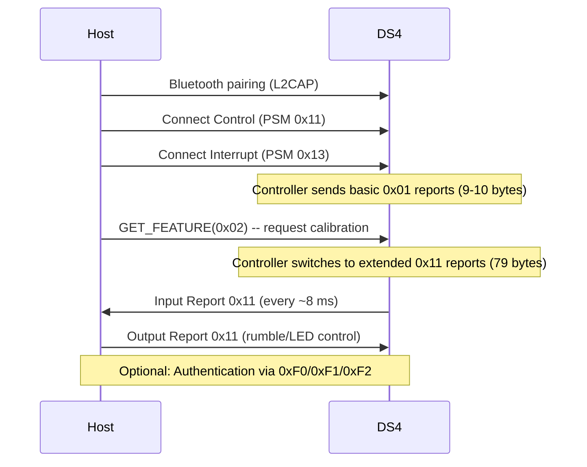

# Sony DualShock 4 Controller -- Comprehensive Technical Overview

> **Document scope:** Hardware identification, communication protocols, HID report
> structure, and macOS-specific implementation notes for the DS4 controller family.
>
> **Related documents:**
> - [02-HID-Report-Descriptor.md](./02-HID-Report-Descriptor.md) -- Annotated HID report descriptor analysis
> - [03-Input-Report-Parsing.md](./03-Input-Report-Parsing.md) -- Byte-level input report parsing guide
> - [04-Output-Reports.md](./04-Output-Reports.md) -- LED, rumble, and audio output control
> - [05-Feature-Reports.md](./05-Feature-Reports.md) -- Calibration, pairing, and vendor feature reports
> - [06-macOS-Driver-Architecture.md](./06-macOS-Driver-Architecture.md) -- IOKit/DriverKit kext implementation

---

## Table of Contents

1. [Controller Identification](#1-controller-identification)
2. [Hardware Revisions](#2-hardware-revisions)
3. [Communication Interfaces](#3-communication-interfaces)
4. [Feature Summary Table](#4-feature-summary-table)
5. [HID Report Structure Summary](#5-hid-report-structure-summary)
6. [Connection Modes](#6-connection-modes)
7. [Physical Specifications](#7-physical-specifications)
8. [Compatibility Notes](#8-compatibility-notes)

---

## 1. Controller Identification

### 1.1 USB Vendor and Product IDs

All genuine Sony DualShock 4 controllers share a single USB Vendor ID. The Product ID
differentiates hardware revisions and connection accessories.

| Device                         | VID      | PID      | Decimal VID | Decimal PID | USB Product String                                |
|-------------------------------|----------|----------|-------------|-------------|---------------------------------------------------|
| DS4 v1 (CUH-ZCT1x)          | `0x054C` | `0x05C4` | 1356        | 1476        | `Wireless Controller`                             |
| DS4 v2 (CUH-ZCT2x)          | `0x054C` | `0x09CC` | 1356        | 2508        | `Wireless Controller`                             |
| Sony Wireless Adapter (SONYWA)| `0x054C` | `0x0BA0` | 1356        | 2976        | `DUALSHOCK 4 USB Wireless Adaptor`                |
| Sony WA DFU Mode             | `0x054C` | `0x0BA1` | 1356        | 2977        | *(DFU firmware update mode)*                      |

> **Source (project):** The `Info.plist` in this project matches `idVendor=1356`
> (`0x054C`) and `idProduct=1476` (`0x05C4`), targeting the DS4 v1 over USB only.
> See `/DS4/Info.plist` lines 29-32. The v2 PID (`0x09CC`) is **not** currently matched.

> **Source (DS4Windows):** `DS4Devices.cs` defines `SONY_VID = 0x054C` and registers
> both `0x5C4` ("DS4 v.1") and `0x09CC` ("DS4 v.2") in its `knownDevices` array.

### 1.2 Bluetooth Device Names

When discovered over Bluetooth, the DS4 advertises under the following HID names
depending on the host-side driver perspective:

| Context                              | Bluetooth Name                                     |
|--------------------------------------|----------------------------------------------------|
| Bluetooth HID discovery              | `Wireless Controller`                              |
| USB HID (Linux `HID_NAME`, v1)       | `Sony Computer Entertainment Wireless Controller`  |
| USB HID (Linux `HID_NAME`, v2)       | `Sony Interactive Entertainment Wireless Controller`|

> **Source (ds4drv):** `backends/hidraw.py` maps both USB name strings and the BT
> name `Wireless Controller` to their respective device classes.

The Bluetooth name change from "Sony Computer Entertainment" to "Sony Interactive
Entertainment" reflects the corporate rebranding that occurred in April 2016, which
coincides with the CUH-ZCT2x hardware revision.

### 1.3 Bluetooth Pairing

To enter pairing mode, hold **Share + PS** simultaneously until the light bar begins
rapid double-flashing (approximately 2 Hz). The controller uses **Bluetooth v2.1+EDR**
with a Qualcomm Atheros AR3002 radio module.

### 1.4 MAC Address and Identification

The DS4 controller's Bluetooth MAC address can be read via USB by issuing a
**GET_FEATURE** request for report ID `0x81` (6 payload bytes). The returned bytes
contain the Bluetooth MAC in reverse byte order.

```
Feature Report 0x81 response (USB):
  Byte [0]: Report ID (0x81)
  Bytes [1-6]: BT MAC address (reverse order)

  Example: response = [0x81, 0xAA, 0xBB, 0xCC, 0xDD, 0xEE, 0xFF]
  Actual MAC = FF:EE:DD:CC:BB:AA
```

> **Source (ds4drv):** `backends/hidraw.py` lines 97-101 implement this exact read:
> ```python
> addr = self.read_feature_report(0x81, 6)[1:]
> addr = ["{0:02x}".format(c) for c in bytearray(addr)]
> addr = ":".join(reversed(addr)).upper()
> ```

Sony-manufactured DualShock 4 controllers use Sony's registered IEEE OUI prefixes.
Common prefixes observed on DS4 hardware include those registered to
**Sony Corporation** and **Sony Interactive Entertainment Inc.** in the IEEE MA-L
registry. The OUI is the first 3 octets of the Bluetooth MAC address.

### 1.5 Third-Party Compatible Controllers

DS4Windows maintains an extensive registry of third-party controllers that emulate the
DS4 protocol. Notable entries include:

| Vendor          | VID      | PID      | Name                         | Notes                          |
|-----------------|----------|----------|------------------------------|--------------------------------|
| Razer           | `0x1532` | `0x1000` | Razer Raiju PS4              | Full DS4 compatibility         |
| Razer           | `0x1532` | `0x1100` | Razer Raion Fightpad         | No gyro calibration            |
| Nacon           | `0x146B` | `0x0D01` | Nacon Revolution Pro v1      | No gyro calibration            |
| Nacon           | `0x146B` | `0x0D02` | Nacon Revolution Pro v2      | No gyro calibration            |
| Hori            | `0x0F0D` | `0x00EE` | Hori PS4 Mini                | No output, no battery, no gyro |
| CronusMax       | `0x054C` | `0x05C5` | CronusMax (PS4 Mode)         | Uses Sony VID                  |

---

## 2. Hardware Revisions

### 2.1 Revision Comparison

```
DS4 v1 (CUH-ZCT1x)                    DS4 v2 (CUH-ZCT2x)
Released: November 2013                Released: September 2016
 ________________________________       ________________________________
|          TOUCHPAD              |     |    ------TOUCHPAD-------       |
|   [no light bar visible]      |     |   [LIGHT BAR STRIP visible]   |
|________________________________|     |________________________________|
|                                |     |                                |
|  (L1) (L2)        (R1) (R2)   |     |  (L1) (L2)        (R1) (R2)   |
|      ___              ___      |     |      ___              ___      |
|     / L \    [S] [O] / R \    |     |     / L \    [S] [O] / R \    |
|     \___/            \___/     |     |     \___/            \___/     |
|         [SHARE]  [OPT]        |     |         [SHARE]  [OPT]        |
|              [PS]              |     |              [PS]              |
|   BLACK face buttons/sticks    |     |   GREY face buttons/sticks    |
|________________________________|     |________________________________|

  USB PID: 0x05C4                        USB PID: 0x09CC
  Battery connector: Large               Battery connector: Small
  Light bar: Rear only                   Light bar: Rear + Touchpad strip
  Bluetooth name suffix:                 Bluetooth name suffix:
    "Sony Computer Entertainment"          "Sony Interactive Entertainment"
  Min Linux kernel: 3.15                 Min Linux kernel: 4.10
```

### 2.2 Detailed Differences

| Attribute                   | DS4 v1 (CUH-ZCT1x)               | DS4 v2 (CUH-ZCT2x)                    |
|-----------------------------|------------------------------------|-----------------------------------------|
| **Model numbers**           | CUH-ZCT1U, CUH-ZCT1E, CUH-ZCT1J, CUH-ZCT1H, CUH-ZCT1K | CUH-ZCT2U, CUH-ZCT2E, CUH-ZCT2J, CUH-ZCT2H, CUH-ZCT2K |
| **USB Product ID**          | `0x05C4`                           | `0x09CC`                                |
| **Release date**            | November 2013                      | September 2016                          |
| **Light bar**               | Rear-facing only                   | Rear + translucent strip on touchpad    |
| **Face button color**       | Black                              | Grey/Charcoal                           |
| **Analog stick rubber**     | Original compound                  | Improved durability compound            |
| **Trigger feel**            | Original                           | Refined spring/travel                   |
| **Battery connector**       | Large (wide) JST-type              | Small (narrow) JST-type                 |
| **Battery capacity**        | 1000 mAh (LIP1522)                | 1000 mAh (LIP1522)                     |
| **USB communication**       | Charge only on PS4; data on PC     | Charge + data on PS4 and PC             |
| **Bluetooth protocol**      | Identical                          | Identical (minor HID descriptor change) |
| **HID report structure**    | Identical byte layout              | Identical byte layout                   |
| **Linux kernel support**    | 3.15+                              | 4.10+ (4.5+ for modified HID descriptor)|
| **Weight**                  | ~210 g                             | ~210 g                                  |

> **Key insight for driver development:** Despite the different USB Product IDs, the
> two hardware revisions use **identical HID report formats** for input, output, and
> feature reports. The only driver-level change needed is matching both PIDs. The v2
> has a slightly modified HID report descriptor at the USB level, but the actual data
> layout within reports is unchanged.

### 2.3 Model Number Suffixes

The letter suffix on the model number indicates the regional market:

| Suffix | Region                    |
|--------|---------------------------|
| U      | North America (USA/Canada)|
| E      | Europe/Australia          |
| J      | Japan                     |
| H      | East Asia / Hong Kong     |
| K      | Korea                     |

---

## 3. Communication Interfaces

### 3.1 Interface Comparison Table

| Property                      | USB                              | Bluetooth                             | Sony Wireless Adapter (SONYWA) |
|-------------------------------|----------------------------------|---------------------------------------|--------------------------------|
| **Connection type**           | Micro-USB (Micro-B) 2.0         | Bluetooth v2.1+EDR                    | USB dongle -> BT bridge        |
| **Input report ID**           | `0x01`                           | `0x01` (basic) / `0x11` (extended)    | `0x01`                         |
| **Input report size**         | 64 bytes                         | 9-10 bytes (basic, varies by firmware) / 78 bytes (extended, hidraw) / 79 bytes (raw L2CAP incl. 0xA1 header) | 64 bytes                       |
| **Output report ID**          | `0x05`                           | `0x11`                                | `0x05`                         |
| **Output report size**        | 32 bytes                         | 78 bytes (legacy) / 334 bytes (ext.)  | 32 bytes                       |
| **Polling rate**              | ~250 Hz (4 ms)                   | ~125 Hz input-only rate (up to ~800 Hz combined I/O rate, see doc 05 for details) | ~250 Hz (4 ms)                 |
| **Data offset**               | Report ID at byte 0              | 2-3 byte BT header before payload     | Report ID at byte 0            |
| **CRC-32 integrity check**    | No                               | Yes (last 4 bytes of extended report) | No                             |
| **Calibration feature report**| `0x02` (37 bytes: 1 ID + 36 data)| `0x05` (41 bytes: 1 ID + 36 data + 4 CRC) | `0x02` (37 bytes: 1 ID + 36 data) |
| **Audio support**             | No (charge + data only)          | Yes (mono speaker, mic, headphone)    | Yes                            |
| **Rumble/LED control**        | Yes                              | Yes                                   | Yes                            |
| **Authentication required**   | No                               | Yes (challenge-response via 0xF0/0xF1)| No                             |
| **Charging**                  | Yes                              | No                                    | No                             |
| **Max simultaneous (PS4)**    | 1 per USB port                   | 4                                     | 1 per dongle                   |

### 3.2 Protocol Stack Diagram

```
USB Connection:
  +---------------------+
  | Application Layer   |  <-- DS4 driver / userspace client
  +---------------------+
  | HID Report Layer    |  <-- Report ID 0x01 (in) / 0x05 (out)
  +---------------------+
  | USB HID Class       |  <-- Interrupt IN/OUT endpoints
  +---------------------+
  | USB 2.0 Transport   |  <-- Micro-B connector
  +---------------------+

Bluetooth Connection:
  +---------------------+
  | Application Layer   |  <-- DS4 driver / userspace client
  +---------------------+
  | HID Report Layer    |  <-- Report ID 0x11 (in/out, extended)
  +---------------------+
  | CRC-32 Integrity    |  <-- Polynomial 0x04C11DB7
  +---------------------+
  | HIDP (HID Profile)  |  <-- L2CAP PSM 0x11 (ctrl) / 0x13 (intr)
  +---------------------+
  | L2CAP               |  <-- Segmentation and reassembly
  +---------------------+
  | ACL (HCI)           |  <-- 3 Mbps EDR
  +---------------------+
  | Bluetooth Radio      |  <-- Qualcomm Atheros AR3002
  +---------------------+
```

### 3.3 EXT Port

The DS4 includes a proprietary EXT (extension) port on the bottom edge:

- **Connector type:** 3.5mm-adjacent proprietary
- **Protocol:** I2C data bus
- **Functions:** Charging, accessory data (e.g., chatpad, extended battery pack)
- **Not used by:** PC/Mac drivers (no public protocol documentation)

---

## 4. Feature Summary Table

| Feature                     | Type     | USB | Bluetooth | Notes                                              |
|-----------------------------|----------|-----|-----------|-----------------------------------------------------|
| Left analog stick (X, Y)    | Input    | Yes | Yes       | 8-bit per axis, 0-255                               |
| Right analog stick (X, Y)   | Input    | Yes | Yes       | 8-bit per axis, 0-255                               |
| D-pad (hat switch)          | Input    | Yes | Yes       | 4-bit, 9 positions (8 directions + centered)        |
| Face buttons (Cross, Circle, Square, Triangle) | Input | Yes | Yes | 1-bit each, digital |
| Shoulder buttons (L1, R1)   | Input    | Yes | Yes       | 1-bit each, digital                                 |
| Trigger buttons (L2, R2)    | Input    | Yes | Yes       | 8-bit analog (0x00-0xFF) + 1-bit digital            |
| L3, R3 (stick click)        | Input    | Yes | Yes       | 1-bit each, digital                                 |
| Share button                | Input    | Yes | Yes       | 1-bit, digital                                      |
| Options button              | Input    | Yes | Yes       | 1-bit, digital                                      |
| PS button                   | Input    | Yes | Yes       | 1-bit, digital                                      |
| Touchpad click              | Input    | Yes | Yes       | 1-bit, digital (full pad is a button)               |
| Touchpad (multitouch)       | Input    | Yes | Yes       | 2 fingers, 12-bit X (0-1919), 12-bit Y (0-942)     |
| 3-axis gyroscope            | Input    | Yes | Yes       | 16-bit signed per axis (angular velocity)           |
| 3-axis accelerometer        | Input    | Yes | Yes       | 16-bit signed per axis (linear acceleration)        |
| Timestamp                   | Input    | Yes | Yes       | 16-bit counter, ~5.33 us resolution                 |
| Battery level               | Input    | Yes | Yes       | 4-bit (0-15), charging flag in byte 30              |
| Temperature                 | Input    | Yes | Yes       | Byte 12, uncalibrated                               |
| Light bar (RGB LED)         | Output   | Yes | Yes       | 24-bit color (8-bit R, G, B) + flash on/off timing  |
| Rumble motor (right/light)  | Output   | Yes | Yes       | 8-bit intensity (0-255), small ERM motor             |
| Rumble motor (left/heavy)   | Output   | Yes | Yes       | 8-bit intensity (0-255), large ERM motor             |
| Mono speaker                | Output   | No  | Yes       | SBC audio, 16/32 kHz; BT only                       |
| Headphone jack (3.5mm TRRS) | I/O      | No  | Yes       | Stereo out + mono mic in; BT only                   |
| Microphone (internal)       | Input    | No  | Yes       | Via headphone jack; BT audio channel                 |
| LED flash timing            | Output   | Yes | Yes       | On/off duration, 0-255 (255 = 2.5 seconds)          |
| Audio volume control        | Output   | Yes*| Yes       | Headphone L/R, mic, speaker; *limited on USB         |

---

## 5. HID Report Structure Summary

### 5.1 Report ID Map

The DS4 exposes a large number of HID reports. The following table categorizes every
report ID present in the USB HID report descriptor (from `dualshock4hid.h`).

#### Input Reports

| Report ID | Hex    | Size (bytes) | Connection | Purpose                                |
|-----------|--------|-------------|------------|----------------------------------------|
| 1         | `0x01` | 64 (USB)    | USB        | Full controller state (primary input)  |
| 1         | `0x01` | 9-10 (BT, varies by firmware) | Bluetooth  | Basic/reduced controller state         |
| 17        | `0x11` | 78 (hidraw) / 79 (raw L2CAP) | Bluetooth  | Extended controller state (full data)  |

#### Output Reports

| Report ID | Hex    | Size (bytes) | Connection | Purpose                                |
|-----------|--------|-------------|------------|----------------------------------------|
| 5         | `0x05` | 32          | USB        | Rumble + LED + flash control           |
| 17        | `0x11` | 78-334      | Bluetooth  | Rumble + LED + flash + audio           |
| 20-25     | `0x14`-`0x19` | varies | Bluetooth | Audio streaming + combined control    |

#### Feature Reports (Calibration and Configuration)

| Report ID | Hex    | Size (bytes) | Usage Page      | Purpose                              |
|-----------|--------|-------------|------------------|---------------------------------------|
| 2         | `0x02` | 37          | Vendor `0xFF00`  | IMU calibration data (USB)            |
| 4         | `0x04` | 37          | Vendor `0xFF00`  | Unknown / reserved                    |
| 5         | `0x05` | 41          | Vendor `0xFF00`  | IMU calibration data (Bluetooth: 1 ID + 36 data + 4 CRC) |
| 8         | `0x08` | 4           | Vendor `0xFF00`  | Unknown / reserved                    |
| 16        | `0x10` | 5           | Vendor `0xFF00`  | Unknown / reserved                    |
| 17        | `0x11` | 3           | Vendor `0xFF00`  | Unknown / reserved                    |
| 18        | `0x12` | 16          | Vendor `0xFF02`  | Unknown / reserved                    |
| 19        | `0x13` | 23          | Vendor `0xFF02`  | Unknown / reserved                    |
| 20        | `0x14` | 17          | Vendor `0xFF05`  | Unknown / reserved                    |
| 21        | `0x15` | 45          | Vendor `0xFF05`  | Unknown / reserved                    |

#### Feature Reports (Vendor-Specific, `0xFF80` Usage Page)

| Report ID | Hex    | Size (bytes) | Purpose                                        |
|-----------|--------|-------------|--------------------------------------------------|
| 128       | `0x80` | 7           | Controller hardware/firmware version info        |
| 129       | `0x81` | 7           | Bluetooth MAC address (reverse byte order)       |
| 130       | `0x82` | 6           | Unknown                                          |
| 131       | `0x83` | 2           | Unknown                                          |
| 132       | `0x84` | 5           | Unknown                                          |
| 133       | `0x85` | 7           | Unknown                                          |
| 134       | `0x86` | 7           | Unknown                                          |
| 135       | `0x87` | 36          | Unknown                                          |
| 136       | `0x88` | 35          | Unknown                                          |
| 137       | `0x89` | 3           | Unknown                                          |

#### Feature Reports (Motion/Sensor Control, `0xFF80` Usage Page cont.)

| Report ID | Hex    | Size (bytes) | Purpose                                        |
|-----------|--------|-------------|--------------------------------------------------|
| 144       | `0x90` | 6           | Unknown                                          |
| 145       | `0x91` | 4           | Unknown                                          |
| 146       | `0x92` | 4           | Unknown                                          |
| 147       | `0x93` | 13          | Unknown                                          |
| 160       | `0xA0` | 7           | Unknown                                          |
| 161       | `0xA1` | 2           | Unknown                                          |
| 162       | `0xA2` | 2           | Unknown                                          |
| 163       | `0xA3` | 49          | Gyro/Accel calibration or factory data           |
| 164       | `0xA4` | 14          | Unknown                                          |
| 165       | `0xA5` | 22          | Unknown                                          |
| 166       | `0xA6` | 22          | Unknown                                          |
| 167       | `0xA7` | 2           | Unknown                                          |
| 168       | `0xA8` | 2           | Unknown                                          |
| 169       | `0xA9` | 9           | Unknown                                          |
| 170       | `0xAA` | 2           | Unknown                                          |
| 171       | `0xAB` | 58          | Unknown                                          |
| 172       | `0xAC` | 58          | Unknown                                          |
| 173       | `0xAD` | 12          | Unknown                                          |
| 174       | `0xAE` | 2           | Unknown                                          |
| 175       | `0xAF` | 3           | Unknown                                          |
| 176       | `0xB0` | 64          | Unknown                                          |

#### Feature Reports (System)

| Report ID | Hex    | Size (bytes) | Purpose                                        |
|-----------|--------|-------------|--------------------------------------------------|
| 240       | `0xF0` | 64          | Authentication challenge data                    |
| 241       | `0xF1` | 64          | Authentication response / key data               |
| 242       | `0xF2` | 16          | Authentication ready status                      |

### 5.2 HID Report Descriptor Structure

The HID report descriptor (from `dualshock4hid.h`, 243 bytes of raw descriptor data)
defines the following logical structure:

```
Collection (Application) -- Usage: Game Pad (0x05), Usage Page: Generic Desktop (0x01)
|
+-- Report ID 0x01 (Input Report -- 64 bytes total)
|   |
|   +-- 4x 8-bit axes (Generic Desktop)
|   |     Usage X  (0x30) = Left Stick X     [0-255]
|   |     Usage Y  (0x31) = Left Stick Y     [0-255]
|   |     Usage Z  (0x32) = Right Stick X    [0-255]
|   |     Usage Rz (0x35) = Right Stick Y    [0-255]
|   |
|   +-- 1x 4-bit Hat Switch (0x39)
|   |     Logical: 0-7, Physical: 0-315 degrees
|   |     Null state (0x08) = centered/released
|   |
|   +-- 14x 1-bit Buttons (Button Page 0x09)
|   |     Buttons 1-14 (Cross, Circle, Square, Triangle,
|   |       L1, R1, L2btn, R2btn, Share, Options, L3, R3,
|   |       PS, Touchpad Click)
|   |
|   +-- 1x 6-bit Vendor Defined (padding/counter)
|   |     Usage Page 0xFF00, Usage 0x20
|   |
|   +-- 2x 8-bit axes (Generic Desktop)
|   |     Usage Rx (0x33) = L2 Trigger Analog  [0-255]
|   |     Usage Ry (0x34) = R2 Trigger Analog  [0-255]
|   |
|   +-- 54x 8-bit Vendor Defined (raw sensor/touchpad data)
|         Usage Page 0xFF00, Usage 0x21
|         Contains: timestamp, temperature, gyro XYZ,
|           accel XYZ, battery, touchpad data, etc.
|
+-- Report ID 0x05 (Output Report -- 32 bytes)
|     Usage Page 0xFF00, Usage 0x22
|     31 bytes of vendor-defined output data
|     (rumble motors, LED RGB, LED flash timing)
|
+-- Report ID 0x04 (Feature Report -- 37 bytes)
|     Usage Page 0xFF00, Usage 0x23
|
+-- Report ID 0x02 (Feature Report -- 37 bytes)
|     Usage Page 0xFF00, Usage 0x24
|     (IMU calibration data)
|
+-- [... additional Feature Reports 0x08-0xB0, 0xF0-0xF2 ...]
|
End Collection
```

> **See also:** [02-HID-Report-Descriptor.md](./02-HID-Report-Descriptor.md) for a
> complete byte-by-byte annotation of the raw descriptor from `dualshock4hid.h`.

---

## 6. Connection Modes

### 6.1 USB Mode

When connected via USB, the DS4 operates in the simplest mode:

- **Input report `0x01`** arrives at **~250 Hz** (every ~4 ms) via the Interrupt IN
  endpoint (`0x84`, 64-byte max packet)
- **Output report `0x05`** is sent via the Interrupt OUT endpoint (`0x03`) to control
  rumble and LED
- **No CRC-32** checksum is required
- **No authentication** sequence is needed
- The report starts directly with the Report ID byte; there is no transport header
- Audio does **not** pass through USB (the headphone jack and internal speaker are
  disabled when connected via USB)

#### USB Input Report 0x01 Byte Map (64 bytes)

```
Offset  Size   Field
------  ----   -----
[0]     1      Report ID (0x01)
[1]     1      Left Stick X        (0x00=left, 0x80=center, 0xFF=right)
[2]     1      Left Stick Y        (0x00=up,   0x80=center, 0xFF=down)
[3]     1      Right Stick X
[4]     1      Right Stick Y
[5]     1      D-Pad + Face Buttons
                 Bits [3:0] = D-Pad (hat: 0=N,1=NE,2=E,3=SE,4=S,5=SW,6=W,7=NW,8=none)
                 Bit  [4]   = Square
                 Bit  [5]   = Cross
                 Bit  [6]   = Circle
                 Bit  [7]   = Triangle
[6]     1      Shoulder + Meta Buttons
                 Bit  [0]   = L1
                 Bit  [1]   = R1
                 Bit  [2]   = L2 (digital)
                 Bit  [3]   = R2 (digital)
                 Bit  [4]   = Share
                 Bit  [5]   = Options
                 Bit  [6]   = L3 (left stick press)
                 Bit  [7]   = R3 (right stick press)
[7]     1      PS + Touchpad + Counter
                 Bit  [0]   = PS Button
                 Bit  [1]   = Touchpad Click
                 Bits [7:2] = Frame Counter (6-bit, increments per report)
[8]     1      L2 Trigger Analog   (0x00=released, 0xFF=fully pressed)
[9]     1      R2 Trigger Analog
[10-11] 2      Timestamp           (16-bit LE, ~5.33 us per unit)
[12]    1      Battery Temperature (uncalibrated)
[13-14] 2      Gyroscope X         (int16_t LE, angular velocity)
[15-16] 2      Gyroscope Y
[17-18] 2      Gyroscope Z
[19-20] 2      Accelerometer X     (int16_t LE, +X = right)
[21-22] 2      Accelerometer Y     (+Y = up)
[23-24] 2      Accelerometer Z     (+Z = toward player)
[25-29] 5      Reserved / Unknown
[30]    1      Battery + Status
                 Bits [3:0] = Battery Level (0-15 scale)
                 Bit  [4]   = USB Cable Connected (charging)
                 Bit  [5]   = Headphones Connected
                 Bit  [6]   = Microphone Connected
                 Bit  [7]   = Unknown
[31-32] 2      Reserved / Unknown
[33]    1      Touchpad Event Count
                 Number of touch data packets in this report
[34]    1      Touchpad Packet Counter (auto-incrementing)
[35]    1      Touch 0 Contact
                 Bits [6:0] = Tracking ID
                 Bit  [7]   = Active (0=touching, 1=not touching)
[36-38] 3      Touch 0 Position
                 [36]       = X low 8 bits
                 [37] [3:0] = X high 4 bits (total 12-bit, 0-1919)
                 [37] [7:4] = Y low 4 bits
                 [38]       = Y high 8 bits (total 12-bit, 0-942)
[39]    1      Touch 1 Contact (same format as Touch 0)
[40-42] 3      Touch 1 Position (same format as Touch 0)
[43]    1      Previous Touch Packet Counter
[44-51] 8      Previous Touch Data (Touch 0 + Touch 1)
[52-63] 12     Reserved / Unknown
```

#### USB Output Report 0x05 Byte Map (32 bytes)

```
Offset  Size   Field
------  ----   -----
[0]     1      Report ID (0x05)
[1]     1      Feature Flags
                 Bit [0] = Enable Rumble (0x01)
                 Bit [1] = Enable Lightbar (0x02)
                 Bit [2] = Enable Flash (0x04)
                 Bit [4] = Headphone Volume L (0x10)
                 Bit [5] = Headphone Volume R (0x20)
                 Bit [6] = Microphone Volume (0x40)
                 Bit [7] = Speaker Volume (0x80)
[2]     1      0x04 (unknown, possibly flags)
[3]     1      Reserved
[4]     1      Rumble Right (light motor, 0-255)
[5]     1      Rumble Left (heavy motor, 0-255)
[6]     1      LED Red (0-255)
[7]     1      LED Green (0-255)
[8]     1      LED Blue (0-255)
[9]     1      LED Flash On Duration (0-255, 255 = 2.5 sec)
[10]    1      LED Flash Off Duration (0-255, 255 = 2.5 sec)
[11-31] 21     Reserved / Audio volume fields
```

### 6.2 Bluetooth Mode

Bluetooth operation is more complex due to protocol overhead and the need for
authentication:

#### Initialization Sequence



#### Bluetooth Input Report 0x11 Byte Map (78 bytes hidraw / 79 bytes raw L2CAP)

The Bluetooth extended report wraps the same data as USB `0x01` with a different
header. The report is 79 bytes at the raw L2CAP layer (including the `0xA1` HID
transaction header), or 78 bytes at the hidraw/application layer (which strips the
`0xA1` header):

```
Offset  Size   Field
------  ----   -----
[0]     1      Bluetooth Transaction Header (0xA1)
[1]     1      Report ID (0x11)
[2]     1      Protocol code (0xC0 | poll_rate)
[3]     1      Unknown / Flags
[4-67]  64     Controller state data (same layout as USB bytes [1-63])
                 [4]  = Left Stick X    (equivalent to USB byte [1])
                 [5]  = Left Stick Y
                 [6]  = Right Stick X
                 [7]  = Right Stick Y
                 [8]  = DPad + Face Buttons
                 ...etc (offset +3 from USB layout at raw L2CAP layer)
[68-74] 7      Additional BT-specific data / reserved
[75-78] 4      CRC-32 checksum (polynomial 0x04C11DB7)
```

> **Offset clarification:** The "+3 from USB layout" offset shown above is from the raw
> L2CAP perspective, where byte [0] is the HID transaction header `0xA1`. From the
> hidraw/application perspective (which most driver code uses), the HID header is
> stripped, making byte [0] the Report ID (`0x11`). In this view, controller state data
> starts at byte [3], creating a **+2 byte offset** from the USB layout (where data
> starts at byte [1]). Most code should use the +2 offset convention.

> **Implementation note (ds4drv):** The Bluetooth backend in `backends/hidraw.py`
> reads the report ID from `buf[0]` and slices off the first 2 bytes before passing
> to `parse_report()`, which then reads data at the same offsets as USB. The raw
> Bluetooth backend in `backends/bluetooth.py` slices off 3 bytes (transaction header
> + report ID + protocol code).

#### Bluetooth Output Report 0x11 Byte Map (78 bytes, legacy)

```
Offset  Size   Field
------  ----   -----
[0]     1      Report ID (0x11)
[1]     1      BT HID Flags: 0xC0 = EnableCRC (bit 6) | EnableHID (bit 7),
                 with optional poll rate in lower bits
[2]     1      BT Flags 2: Microphone enable bits (for audio), typically 0x00
                 for non-audio output
[3]     1      Unknown
[4]     1      Feature flags (same meaning as USB byte [1])
[5]     1      0x04
[6]     1      Rumble Right (light motor)
[7]     1      Rumble Left (heavy motor)
[8]     1      LED Red
[9]     1      LED Green
[10]    1      LED Blue
[11]    1      LED Flash On Duration
[12]    1      LED Flash Off Duration
[13-73] 61     Volume control, audio data, reserved
[74-77] 4      CRC-32 checksum
```

#### CRC-32 Calculation for Bluetooth

All Bluetooth HID reports with ID >= `0x11` include a CRC-32 checksum over the
entire report payload (excluding the CRC bytes themselves). The CRC uses the standard
Ethernet polynomial `0x04C11DB7` (also known as CRC-32/ISO-HDLC). The seed value is
computed from a header byte `0xA2` prepended to the data before CRC calculation for
output reports.

```
CRC-32 input = [header_byte] + [report_bytes_0 .. N-4]
CRC-32 output = last 4 bytes of report (little-endian)
```

### 6.3 Sony Wireless Adapter (SONYWA) Mode

The Sony Wireless Adapter (`0x054C:0x0BA0`) presents to the host as a USB HID device
but internally communicates with the DS4 over a proprietary Bluetooth-like link. From
the driver's perspective, it behaves identically to a USB connection:

- Input report `0x01`, 64 bytes
- Output report `0x05`, 32 bytes
- No CRC-32 required
- Supports audio (unlike raw USB)
- Byte 31 of input report indicates controller sync status (`0x00` = synced)

### 6.4 Comparison of Data Flow

```
USB Mode:
  DS4 --> [USB Micro-B] --> [USB Hub] --> [Host HID Driver]
  64-byte reports, no overhead, ~250 Hz

Bluetooth Mode:
  DS4 --> [BT Radio] --> [L2CAP] --> [HIDP] --> [Host HID Driver]
  78-byte reports at hidraw layer (incl. 4-byte CRC), BT header overhead, ~125 Hz input-only rate

SONYWA Mode:
  DS4 --> [BT Radio] --> [SONYWA Dongle] --> [USB] --> [Host HID Driver]
  64-byte reports (USB-style), transparent bridge, ~250 Hz
```

### 6.5 Report Rate and Latency

| Mode              | Report Rate | Report Interval | Effective Latency | Notes                          |
|-------------------|-------------|-----------------|-------------------|--------------------------------|
| USB               | ~250 Hz     | ~4 ms           | 4-8 ms            | Most consistent timing         |
| Bluetooth (1 pad) | ~125 Hz input-only (~800 Hz combined I/O) | ~8 ms (input-only) / ~1.25 ms (combined) | 8-15 ms | Occasional 15 ms gaps observed |
| Bluetooth (4 pads)| ~31 Hz each | ~32 ms          | 32-40 ms          | BT bandwidth shared            |
| SONYWA            | ~250 Hz     | ~4 ms           | 4-8 ms            | USB-like latency               |

---

## 7. Physical Specifications

### 7.1 Dimensions and Weight

| Specification           | Value                              |
|------------------------|------------------------------------|
| **Width**              | 162 mm (6.4 in)                    |
| **Height**             | 52 mm (2.0 in)                     |
| **Depth**              | 98 mm (3.9 in)                     |
| **Weight**             | ~210 g (7.4 oz)                    |
| **Cable**              | Micro-USB (Micro-B), not included  |

### 7.2 Battery

| Specification           | Value                              |
|------------------------|------------------------------------|
| **Type**               | Built-in rechargeable Li-ion       |
| **Model**              | LIP1522                            |
| **Voltage**            | 3.65V DC                           |
| **Capacity**           | 1000 mAh                           |
| **Charging**           | Via USB, 5V 800mA                  |
| **Charge time**        | ~2 hours                           |
| **Battery life**       | 4-8 hours (varies with features)   |
| **v1 connector**       | Large JST-type (wide plug)         |
| **v2 connector**       | Small JST-type (narrow plug)       |

### 7.3 Sensors

| Sensor                 | Specification                                   |
|------------------------|-------------------------------------------------|
| **Gyroscope**          | 3-axis, 16-bit signed, right-hand rule          |
| **Accelerometer**      | 3-axis, 16-bit signed, +X=right, +Y=up, +Z=player-facing |
| **Touchpad**           | Capacitive, 2-point multitouch                  |
| **Touchpad resolution**| 1920 x 943 units (X: 0-1919, Y: 0-942)         |
| **Touchpad dimensions**| ~62 x 28 mm physical area                       |

### 7.4 Haptics and Audio

| Component              | Specification                                   |
|------------------------|-------------------------------------------------|
| **Rumble (right)**     | ERM motor, light/fast, 8-bit control            |
| **Rumble (left)**      | ERM motor, heavy/slow, 8-bit control            |
| **Light bar**          | RGB LED, 24-bit color, rear-mounted             |
| **Light bar (v2)**     | Same RGB + translucent touchpad strip            |
| **Speaker**            | Mono, Bluetooth-only, SBC codec                 |
| **Audio output**       | 32 kHz (1-2 players), 16 kHz (3-4 players)     |
| **Headphone jack**     | 3.5mm TRRS, stereo out + mono mic in            |

### 7.5 Wireless

| Specification           | Value                              |
|------------------------|------------------------------------|
| **Bluetooth version**  | v2.1+EDR                           |
| **Bluetooth module**   | Qualcomm Atheros AR3002            |
| **Max data rate**      | 3 Mbps (EDR)                       |
| **Range**              | ~10 m (33 ft) typical              |
| **Frequency**          | 2.4 GHz ISM band                   |

---

## 8. Compatibility Notes

### 8.1 macOS-Specific Considerations

#### IOKit / Kernel Extension (KEXT) Matching

The current project (`com.LittleBlackHat.driver.DS4`) is a KEXT that matches against
`IOUSBDevice` with the v1 VID/PID:

```xml
<key>IOKitPersonalities</key>
<dict>
    <key>DS4</key>
    <dict>
        <key>IOProviderClass</key>
        <string>IOUSBDevice</string>
        <key>idVendor</key>
        <integer>1356</integer>    <!-- 0x054C -->
        <key>idProduct</key>
        <integer>1476</integer>    <!-- 0x05C4 -->
    </dict>
</dict>
```

**Action items for full compatibility:**
1. Add a second personality entry for DS4 v2 (`idProduct` = 2508 / `0x09CC`)
2. Consider adding a third entry for the Sony Wireless Adapter (`idProduct` = 2976 / `0x0BA0`)
3. For Bluetooth support, match against `IOBluetoothHIDDriver` instead of `IOUSBDevice`

#### macOS KEXT Deprecation

Apple has deprecated kernel extensions (KEXTs) starting with macOS 10.15 (Catalina)
and is transitioning to **DriverKit** (DEXT) user-space drivers. Considerations:

| macOS Version      | KEXT Status                          | Recommended Approach        |
|-------------------|--------------------------------------|-----------------------------|
| 10.14 (Mojave)    | Fully supported                      | KEXT (current approach)     |
| 10.15 (Catalina)  | Supported with user approval         | KEXT with migration plan    |
| 11.0 (Big Sur)    | Deprecated, restricted on Apple Silicon | DriverKit preferred      |
| 12.0+ (Monterey+) | Heavily restricted                   | DriverKit required          |
| 13.0+ (Ventura+)  | Further restricted                   | DriverKit or HID userspace  |

#### Native macOS HID Support

macOS natively recognizes the DS4 as a standard HID game controller through
`IOHIDFamily`. Without a custom driver:

- **USB:** Basic button and axis inputs are exposed to `IOHIDManager`. The DS4
  appears as a generic gamepad. Touchpad, gyro, accelerometer, and vendor-specific
  features are available only through raw vendor-defined HID data.
- **Bluetooth:** The DS4 pairs via System Preferences > Bluetooth. By default, macOS
  only reads the basic `0x01` report. Sending feature report `0x02` is required to
  activate extended `0x11` reports with full sensor data.
- **Game Controller Framework:** Starting with macOS 11 (Big Sur), Apple's
  `GameController.framework` (GCController) has native DS4 support, providing a
  higher-level API for button/stick/gyro input without requiring a custom driver.

#### Bluetooth Pairing on macOS

1. Put DS4 into pairing mode (hold Share + PS until rapid flash)
2. Open System Preferences (or System Settings) > Bluetooth
3. DS4 appears as "DUALSHOCK 4 Wireless Controller" or "Wireless Controller"
4. Click "Connect" -- no PIN required (Bluetooth 2.1+ SSP)
5. The light bar color will change to indicate the assigned player number

**Known issues:**
- macOS may cache a stale Bluetooth connection. If the controller was previously
  paired to another device (e.g., PS4), it may require manual unpairing/re-pairing.
- Bluetooth audio features (speaker, headphone jack) are not natively supported on
  macOS; the HID driver would need to implement the audio reports (`0x14`-`0x19`).
- Sleep/wake can cause the Bluetooth connection to drop. Reconnection may require
  pressing the PS button.

#### USB Endpoint Configuration

On macOS, the DS4 USB interface exposes:

| Endpoint         | Address | Type      | Direction | Max Packet | Interval |
|-----------------|---------|-----------|-----------|------------|----------|
| Interrupt IN    | `0x84`  | Interrupt | Device->Host | 64 bytes | 5 ms    |
| Interrupt OUT   | `0x03`  | Interrupt | Host->Device | 64 bytes | 5 ms    |

The `IOUSBHostInterface` can be used in DriverKit to claim these endpoints.

### 8.2 Cross-Platform Kernel Driver Status

| Platform        | Driver               | Min Version | Notes                                |
|----------------|----------------------|-------------|--------------------------------------|
| Linux          | `hid-sony`           | 3.15        | DS4v1; full support                  |
| Linux          | `hid-sony`           | 4.10        | DS4v2; full support                  |
| Linux          | `hid-playstation`    | 6.2         | Modern replacement for hid-sony      |
| Windows        | DS4Windows (userland)| Win 7+      | Third-party; XInput emulation        |
| macOS          | IOHIDFamily (native) | 10.9+       | Basic gamepad; no advanced features   |
| macOS          | GameController.framework | 11.0+   | Native DS4 support                   |

### 8.3 Known Quirks

1. **DS4v1 USB data on PS4 vs PC:** The DS4v1 (`CUH-ZCT1x`) only charges via USB
   when connected to a PS4 -- it does not send HID data over USB to the PS4 console.
   On PC/Mac, USB data transfer works correctly.

2. **Bluetooth report mode transition:** When first connected via Bluetooth, the DS4
   sends minimal `0x01` reports (9-10 bytes). A host must read feature report `0x02`
   (USB) or `0x05` (BT) to trigger the controller to switch to extended `0x11`
   reports. Without this, gyro/accel/touchpad data is unavailable. **Note:** On
   Bluetooth, the calibration report ID is `0x05` (not `0x02` as on USB). However,
   the hidraw layer transparently maps USB report ID `0x02` to BT report ID `0x05`,
   so code using hidraw can use `0x02` for both transports.

3. **CRC-32 validation on fake controllers:** Some third-party controllers that clone
   the DS4 VID/PID do not correctly compute the Bluetooth CRC-32 checksum. DS4Windows
   handles this by falling back to the basic `0x01` report format after multiple CRC
   failures.

4. **Asymmetric rumble motors:** The right motor is physically smaller and lighter
   (high-frequency), while the left motor is larger and heavier (low-frequency).
   Despite both accepting 0-255 intensity values, equal values produce very different
   physical feedback.

5. **Touchpad coordinate system:** The touchpad origin (0,0) is at the **top-left**
   corner. X increases rightward (0-1919), Y increases downward (0-942). The active
   bit in the tracking byte is **inverted**: bit 7 = 0 means the finger IS touching;
   bit 7 = 1 means it is NOT touching.

---

## References

- **psdevwiki.com** -- [DS4-USB Protocol](https://www.psdevwiki.com/ps4/DS4-USB),
  [DS4-BT Protocol](https://www.psdevwiki.com/ps4/DS4-BT)
- **controllers.fandom.com** -- [Sony DualShock 4](https://controllers.fandom.com/wiki/Sony_DualShock_4)
- **wiki.gentoo.org** -- [Sony DualShock](https://wiki.gentoo.org/wiki/Sony_DualShock#DualShock_4)
- **pcgamingwiki.com** -- [Controller:DualShock 4](https://www.pcgamingwiki.com/wiki/Controller:DualShock_4)
- **DS4Windows** -- [GitHub Repository](https://github.com/Ryochan7/DS4Windows) (`DS4Devices.cs`, `DS4Device.cs`)
- **ds4drv** -- [GitHub Repository](https://github.com/chrippa/ds4drv) (`device.py`, `backends/`)

---

*Document generated for the ds4mac project. See `DS4/dualshock4hid.h` for the raw HID
report descriptor and `DS4/Info.plist` for current IOKit matching configuration.*
