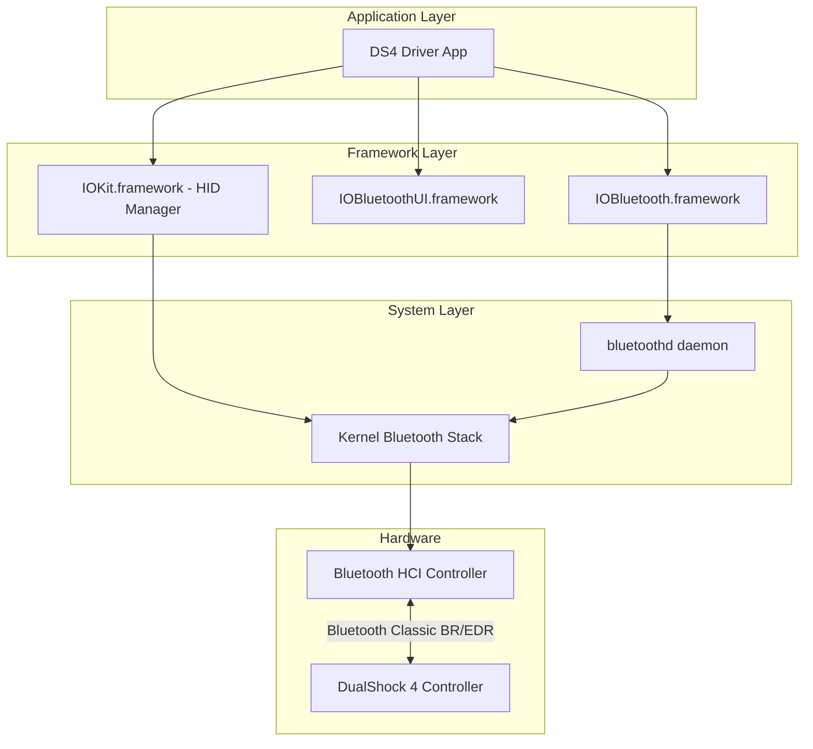
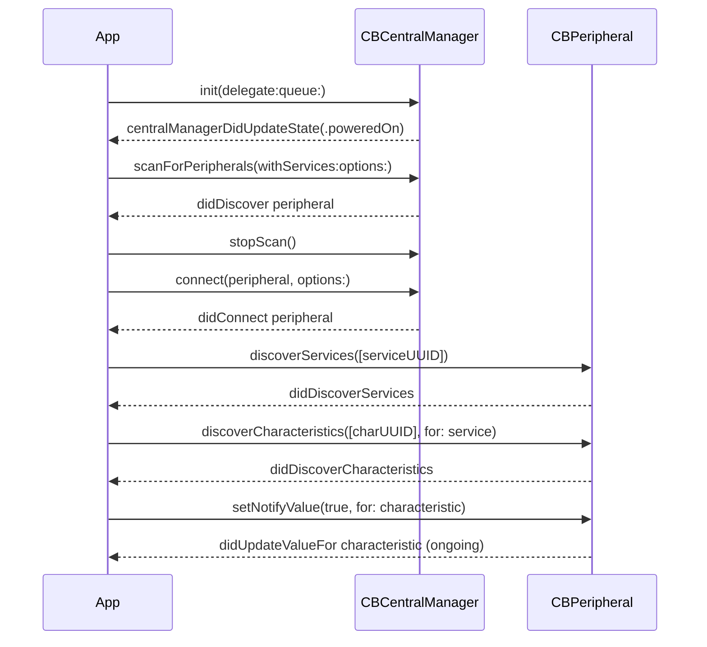
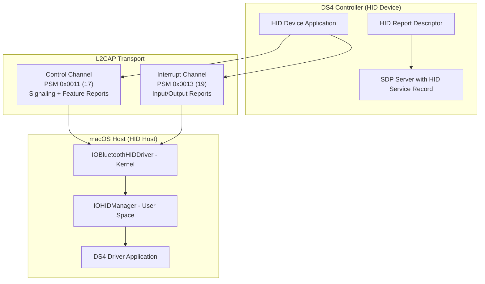
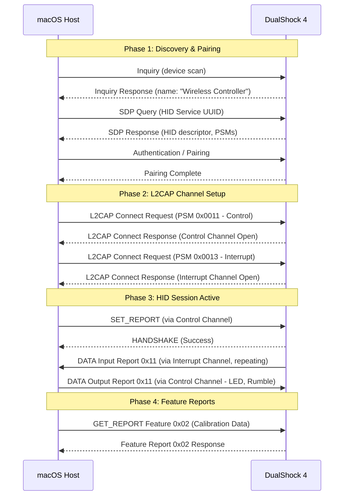
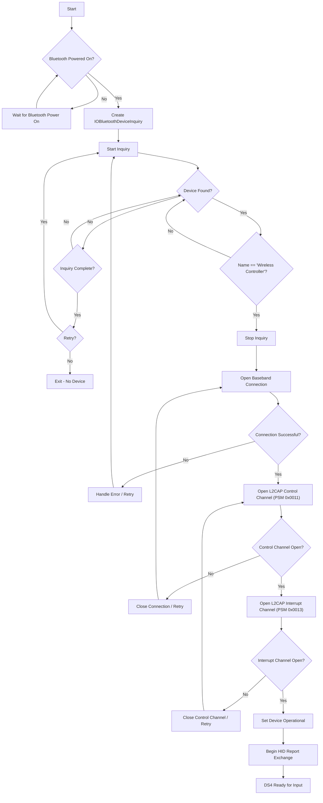
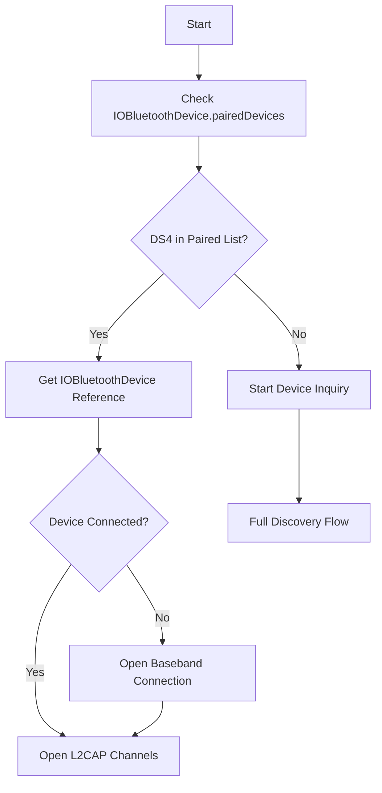
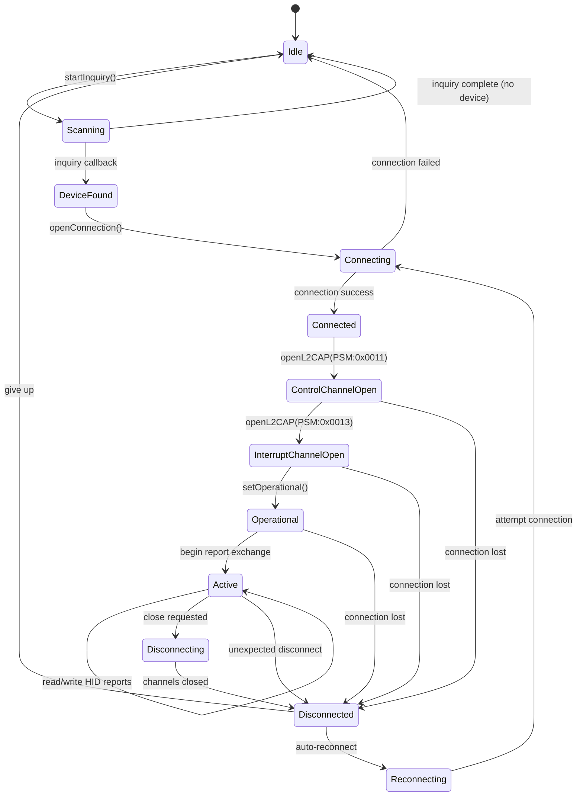
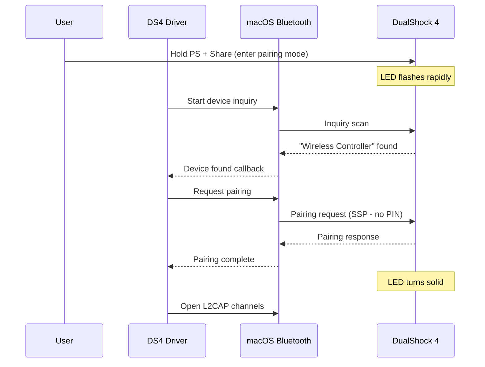

# Core Bluetooth & Bluetooth Classic API Reference for macOS

> **Document Scope:** Comprehensive API reference for building a DualShock 4 controller driver on macOS using Apple's Bluetooth frameworks. Covers CoreBluetooth (BLE), IOBluetooth (Classic), IOBluetoothUI, ExternalAccessory, and AccessorySetupKit.
>
> **Cross-Reference:** See [DS4 Bluetooth Protocol](./05-DS4-Bluetooth-Protocol.md) for the DualShock 4 wire protocol, report formats, and controller-specific behavior. See also [macOS Driver Architecture](./10-macOS-Driver-Architecture.md) for the full system architecture.

---

## Table of Contents

1. [Framework Overview & Decision Matrix](#1-framework-overview--decision-matrix)
2. [CoreBluetooth (BLE)](#2-corebluetooth-ble)
3. [IOBluetooth (Classic)](#3-iobluetooth-classic)
4. [HID Profile over Bluetooth](#4-hid-profile-over-bluetooth)
5. [Device Discovery Flow](#5-device-discovery-flow)
6. [Data Exchange](#6-data-exchange)
7. [AccessorySetupKit](#7-accessorysetupkit)
8. [Connection Lifecycle](#8-connection-lifecycle)
9. [Code Examples](#9-code-examples)
10. [DS4-Specific Bluetooth Notes](#10-ds4-specific-bluetooth-notes)
11. [Entitlements & Permissions](#11-entitlements--permissions)
12. [Appendix: API Quick Reference Tables](#appendix-api-quick-reference-tables)

---

## 1. Framework Overview & Decision Matrix

macOS provides several Bluetooth-related frameworks, each targeting different use cases. Understanding which framework to use is critical for a DS4 driver.

### 1.1 Framework Summary

| Framework | Transport | Purpose | macOS Availability | DS4 Relevance |
|-----------|-----------|---------|-------------------|---------------|
| **IOBluetooth** | Bluetooth Classic (BR/EDR) | L2CAP/RFCOMM channels, device discovery, SDP | macOS 10.2+ | **PRIMARY** -- DS4 uses Bluetooth Classic HID |
| **IOBluetoothUI** | Bluetooth Classic (BR/EDR) | UI panels for device selection, pairing | macOS 10.2+ | Useful for pairing UI |
| **CoreBluetooth** | Bluetooth Low Energy (BLE) | GATT services/characteristics, BLE scanning | macOS 10.10+ | Not applicable -- DS4 is not BLE |
| **ExternalAccessory** | MFi Bluetooth/Lightning | MFi-certified accessory communication | macOS (limited) | Not applicable -- DS4 is not MFi |
| **AccessorySetupKit** | BLE + Wi-Fi | Modern accessory authorization | iOS 18+ only | Not available on macOS |
| **IOKit (HID)** | USB + Bluetooth HID | HID device access via IOHIDManager | macOS 10.0+ | Alternative approach via system HID layer |
| **GameController** | All | High-level game controller API | macOS 10.9+ (framework); DS4 support added in macOS 10.15 Catalina | Supported since macOS 10.15 Catalina for DS4 |

### 1.2 Decision Matrix for DS4 Driver

```
Is the DS4 a BLE device?
  NO --> CoreBluetooth is NOT the right choice

Is the DS4 an MFi accessory?
  NO --> ExternalAccessory is NOT the right choice

Does the DS4 use Bluetooth Classic HID?
  YES --> IOBluetooth is the PRIMARY framework
         Use IOBluetoothDevice for discovery
         Use IOBluetoothL2CAPChannel for data exchange
         Use IOBluetoothDeviceInquiry for scanning

Do you need system-level HID integration?
  YES --> IOKit (IOHIDManager) can intercept the DS4
          after macOS pairs it as a standard HID device

Do you need a UI for pairing?
  YES --> IOBluetoothUI provides standard pairing panels
```

### 1.3 Recommended Architecture for DS4 Driver



### 1.4 macOS Bluetooth Stack Architecture

Apple's macOS Bluetooth stack is split between kernel space and user space:

```
+----------------------------------------------------------+
|                    User Space                              |
|                                                            |
|  +------------------+  +------------------+                |
|  | IOBluetooth.fwk  |  | IOBluetoothUI.fwk|               |
|  | (Obj-C / Swift)  |  | (Panels/Dialogs) |               |
|  +--------+---------+  +--------+---------+                |
|           |                      |                         |
|  +--------v---------+           |                         |
|  | User-Level L2CAP |           |                         |
|  | User-Level RFCOMM|           |                         |
|  | SDP Client       |           |                         |
|  | OBEX Client      |           |                         |
|  +--------+---------+           |                         |
+-----------|---------------------|-------------------------+
            |                     |
+-----------v---------------------v-------------------------+
|                    Kernel Space                            |
|                                                            |
|  +---------------------------+                             |
|  | In-Kernel L2CAP Layer     | Multiplexing, segmentation  |
|  +---------------------------+                             |
|  | In-Kernel RFCOMM Layer    | Serial port emulation       |
|  +---------------------------+                             |
|  | IOBluetoothHCIController  | HCI command/event handling  |
|  |   (abstract base class)   |                             |
|  +---------------------------+                             |
|  | AppleBluetoothUSB/PCIe    | Hardware transport driver   |
|  |   HCIController           |                             |
|  +---------------------------+                             |
+-----------------------------------------------------------+
            |
            v
    [Bluetooth Radio Hardware]
```

---

## 2. CoreBluetooth (BLE)

> **Note for DS4 development:** The DualShock 4 uses Bluetooth Classic (BR/EDR), NOT Bluetooth Low Energy (BLE). CoreBluetooth is documented here for completeness and for understanding the BLE side of Apple's Bluetooth stack, but it is NOT the framework to use for DS4 communication.

### 2.1 Key Classes

| Class | Role |
|-------|------|
| `CBCentralManager` | Scans for, discovers, connects to, and manages BLE peripherals |
| `CBPeripheral` | Represents a remote BLE device with services and characteristics |
| `CBPeripheralManager` | Publishes services for the local device to act as a peripheral |
| `CBService` | A collection of characteristics that describe a peripheral's feature |
| `CBCharacteristic` | A value and properties belonging to a service |
| `CBDescriptor` | Metadata about a characteristic's value |
| `CBUUID` | Universally unique identifier for services and characteristics |
| `CBL2CAPChannel` | BLE L2CAP Connection-Oriented Channel (CoC) -- iOS 11+ / macOS 10.13+ |

### 2.2 Core Protocols

| Protocol | Adopted By | Key Methods |
|----------|-----------|-------------|
| `CBCentralManagerDelegate` | Central manager delegate | `centralManagerDidUpdateState(_:)`, `centralManager(_:didDiscover:advertisementData:rssi:)`, `centralManager(_:didConnect:)`, `centralManager(_:didFailToConnect:error:)`, `centralManager(_:didDisconnectPeripheral:error:)` |
| `CBPeripheralDelegate` | Peripheral interaction delegate | `peripheral(_:didDiscoverServices:)`, `peripheral(_:didDiscoverCharacteristicsFor:error:)`, `peripheral(_:didUpdateValueFor:error:)`, `peripheral(_:didWriteValueFor:error:)` |
| `CBPeripheralManagerDelegate` | Peripheral role delegate | `peripheralManagerDidUpdateState(_:)`, `peripheralManager(_:didReceiveRead:)`, `peripheralManager(_:didReceiveWrite:)` |

### 2.3 BLE Discovery & Connection Flow



### 2.4 CBCentralManager States

| State | Value | Meaning |
|-------|-------|---------|
| `.unknown` | 0 | State not yet known |
| `.resetting` | 1 | Connection temporarily lost; will update |
| `.unsupported` | 2 | Device does not support BLE |
| `.unauthorized` | 3 | App not authorized to use BLE |
| `.poweredOff` | 4 | Bluetooth is turned off |
| `.poweredOn` | 5 | Bluetooth is on and ready |

### 2.5 Why NOT CoreBluetooth for DS4

- CoreBluetooth operates exclusively over BLE (Bluetooth Low Energy / Bluetooth 4.0+)
- The DualShock 4 controller uses **Bluetooth Classic (BR/EDR)** with the HID profile
- The DS4's Bluetooth module (Qualcomm Atheros AR3002) operates in BR/EDR mode
- CoreBluetooth cannot discover or connect to Bluetooth Classic devices
- The L2CAP PSM channels used by DS4 HID (0x0011 control, 0x0013 interrupt) are Classic Bluetooth channels, not BLE L2CAP CoC channels

---

## 3. IOBluetooth (Classic)

> **This is the PRIMARY framework for DS4 driver development on macOS.**

IOBluetooth provides user-space access to Bluetooth Classic (BR/EDR) devices. It supports L2CAP channels, RFCOMM channels, device discovery, SDP service queries, and all Bluetooth Classic profiles including HID.

**Location:** `/System/Library/Frameworks/IOBluetooth.framework`

**Import:**
```swift
import IOBluetooth
```

### 3.1 Class Hierarchy

```
NSObject
├── IOBluetoothObject (base class for BT objects)
│   ├── IOBluetoothDevice
│   ├── IOBluetoothL2CAPChannel
│   └── IOBluetoothRFCOMMChannel
├── IOBluetoothHostController
├── IOBluetoothDeviceInquiry
├── IOBluetoothUserNotification
├── IOBluetoothSDPServiceRecord
├── IOBluetoothSDPServiceAttribute
├── IOBluetoothSDPDataElement
├── IOBluetoothSDPUUID
├── OBEXSession
│   └── IOBluetoothOBEXSession
└── OBEXFileTransferServices
```

### 3.2 IOBluetoothDevice

The root object for interacting with a remote Bluetooth device. Represents a single remote Bluetooth device and provides methods for connection management, channel opening, and SDP queries.

#### Key Properties

| Property | Type | Description |
|----------|------|-------------|
| `name` | `String?` | The human-readable name of the device |
| `nameOrAddress` | `String` | Name if available, otherwise the address string |
| `addressString` | `String` | The Bluetooth address as a string (e.g., "AA:BB:CC:DD:EE:FF") |
| `classOfDevice` | `BluetoothClassOfDevice` | The Class of Device value |
| `deviceClassMajor` | `BluetoothDeviceClassMajor` | Major device class |
| `deviceClassMinor` | `BluetoothDeviceClassMinor` | Minor device class |
| `serviceClassMajor` | `BluetoothServiceClassMajor` | Service class bits |
| `isConnected()` | `Bool` | Whether a baseband connection exists |
| `isPaired()` | `Bool` | Whether the device has been paired |
| `services` | `[IOBluetoothSDPServiceRecord]?` | Cached SDP service records |

#### Key Methods

| Method | Return | Description |
|--------|--------|-------------|
| `pairedDevices()` | `[Any]?` | **Class method.** Returns all paired Bluetooth devices |
| `openConnection()` | `IOReturn` | Opens a baseband connection synchronously |
| `openConnection(_ target: Any?)` | `IOReturn` | Opens connection asynchronously with delegate |
| `closeConnection()` | `IOReturn` | Closes the baseband connection |
| `openL2CAPChannelSync(_ newChannel: AutoreleasingUnsafeMutablePointer<IOBluetoothL2CAPChannel?>!, withPSM psm: BluetoothL2CAPPSM, delegate: Any?)` | `IOReturn` | Opens an L2CAP channel synchronously |
| `openL2CAPChannelAsync(_ newChannel: AutoreleasingUnsafeMutablePointer<IOBluetoothL2CAPChannel?>!, withPSM psm: BluetoothL2CAPPSM, delegate: Any?)` | `IOReturn` | Opens an L2CAP channel asynchronously |
| `performSDPQuery(_ target: Any?)` | `IOReturn` | Performs an SDP query on the remote device |
| `performSDPQuery(_ target: Any?, uuids: [IOBluetoothSDPUUID]?)` | `IOReturn` | SDP query filtered by UUID |
| `register(forDisconnectNotification observer: Any?, selector: Selector)` | `IOBluetoothUserNotification?` | Registers for disconnect notifications |

### 3.3 IOBluetoothL2CAPChannel

Represents a single open L2CAP (Logical Link Control and Adaptation Protocol) channel. This is the primary data conduit between local and remote Bluetooth devices.

#### Key Properties

| Property | Type | Description |
|----------|------|-------------|
| `device` | `IOBluetoothDevice` | The remote device this channel is connected to |
| `psm` | `BluetoothL2CAPPSM` | The PSM (Protocol/Service Multiplexer) of the channel |
| `localChannelID` | `BluetoothL2CAPChannelID` | Local channel identifier |
| `remoteChannelID` | `BluetoothL2CAPChannelID` | Remote channel identifier |
| `isIncoming` | `Bool` | Whether the channel is incoming |
| `outgoingMTU` | `BluetoothL2CAPMTU` | Maximum transmission unit for outgoing data |
| `incomingMTU` | `BluetoothL2CAPMTU` | Maximum transmission unit for incoming data |

#### Key Methods

| Method | Return | Description |
|--------|--------|-------------|
| `setDelegate(_ channelDelegate: Any?)` | `IOReturn` | Sets the delegate for channel events |
| `write(_ data: UnsafeMutableRawPointer!, length: UInt16)` | `IOReturn` | Synchronous write (blocks until complete or error) |
| `writeAsync(_ data: UnsafeMutableRawPointer!, length: UInt16, refcon: UnsafeMutableRawPointer?)` | `IOReturn` | Asynchronous write with completion callback |
| `closeChannel()` | `IOReturn` | Closes the L2CAP channel |
| `register(forChannelCloseNotification observer: Any?, selector: Selector)` | `IOBluetoothUserNotification?` | Register for channel close notification |

#### Class Methods

| Method | Return | Description |
|--------|--------|-------------|
| `register(forChannelOpenNotifications observer: Any?, selector: Selector)` | `IOBluetoothUserNotification?` | Register for any L2CAP channel open |
| `register(forChannelOpenNotifications observer: Any?, selector: Selector, withPSM psm: BluetoothL2CAPPSM, direction: IOBluetoothUserNotificationChannelDirection)` | `IOBluetoothUserNotification?` | Register for specific PSM channel open |

### 3.4 IOBluetoothL2CAPChannel Delegate Methods

The L2CAP channel delegate receives notifications about channel events. All methods are optional but strongly recommended.

| Delegate Method | Description |
|----------------|-------------|
| `l2capChannelOpenComplete(_ l2capChannel: IOBluetoothL2CAPChannel!, status: IOReturn)` | Channel open completed (or failed) |
| `l2capChannelClosed(_ l2capChannel: IOBluetoothL2CAPChannel!)` | Channel has been closed |
| `l2capChannelData(_ l2capChannel: IOBluetoothL2CAPChannel!, data dataPointer: UnsafeMutableRawPointer!, length dataLength: Int)` | Data received on the channel |
| `l2capChannelWriteComplete(_ l2capChannel: IOBluetoothL2CAPChannel!, refcon: UnsafeMutableRawPointer!, status: IOReturn)` | Asynchronous write completed |
| `l2capChannelReconfigured(_ l2capChannel: IOBluetoothL2CAPChannel!)` | Channel configuration changed |
| `l2capChannelQueueSpaceAvailable(_ l2capChannel: IOBluetoothL2CAPChannel!)` | Write queue space available |

### 3.5 IOBluetoothDeviceInquiry

Performs non-GUI Bluetooth device discovery. Used when the IOBluetoothUI device selector panels are not appropriate.

> **Warning:** Device inquiry can negatively affect nearby Bluetooth devices. Apple recommends using the IOBluetoothUI framework for device discovery whenever possible. Do not invoke remote name requests on found IOBluetoothDevice objects while the inquiry is running, as this may deadlock the process.

#### Key Properties

| Property | Type | Description |
|----------|------|-------------|
| `delegate` | `Any?` | The delegate for inquiry events |
| `inquiryLength` | `UInt8` | Length of inquiry in 1.28-second units (default: 10) |
| `searchType` | `IOBluetoothDeviceSearchTypes` | Type of search (classic, LE, or both) |
| `updateNewDeviceNames` | `Bool` | Whether to retrieve names of found devices |

#### Key Methods

| Method | Return | Description |
|--------|--------|-------------|
| `start()` | `IOReturn` | Starts the device inquiry |
| `stop()` | `IOReturn` | Stops the device inquiry |
| `foundDevices()` | `[Any]?` | Returns the list of found devices |
| `clearFoundDevices()` | Void | Clears the found devices list |

### 3.6 IOBluetoothDeviceInquiryDelegate

| Delegate Method | Description |
|----------------|-------------|
| `deviceInquiryStarted(_ sender: IOBluetoothDeviceInquiry!)` | Inquiry has started |
| `deviceInquiryDeviceFound(_ sender: IOBluetoothDeviceInquiry!, device: IOBluetoothDevice!)` | A device was found during inquiry |
| `deviceInquiryDeviceNameUpdated(_ sender: IOBluetoothDeviceInquiry!, device: IOBluetoothDevice!, devicesRemaining: UInt32)` | Device name was retrieved |
| `deviceInquiryUpdatingDeviceNamesStarted(_ sender: IOBluetoothDeviceInquiry!, devicesRemaining: UInt32)` | Name update phase started |
| `deviceInquiryComplete(_ sender: IOBluetoothDeviceInquiry!, error: IOReturn, aborted: Bool)` | Inquiry completed |

### 3.7 IOBluetoothHostController

Represents the local Bluetooth hardware controller. Provides access to controller properties and power state.

| Property / Method | Type | Description |
|-------------------|------|-------------|
| `default()` | `IOBluetoothHostController?` | Returns the default host controller |
| `powerState` | `BluetoothHCIPowerState` | Current power state |
| `addressAsString()` | `String?` | The local Bluetooth address |
| `nameAsString()` | `String?` | The local device name |
| `classOfDevice` | `BluetoothClassOfDevice` | The local Class of Device |

### 3.8 IOBluetoothSDPServiceRecord

Represents a single SDP (Service Discovery Protocol) service record. The DS4 advertises its HID service via SDP, which can be queried.

| Property / Method | Type | Description |
|-------------------|------|-------------|
| `device` | `IOBluetoothDevice?` | Device offering this service |
| `attributes` | `[AnyHashable: Any]?` | Dictionary of SDP attributes |
| `getL2CAPPSM(_ outPSM: UnsafeMutablePointer<BluetoothL2CAPPSM>!)` | `IOReturn` | Extract the L2CAP PSM from the record |
| `getRFCOMMChannelID(_ outChannelID: UnsafeMutablePointer<BluetoothRFCOMMChannelID>!)` | `IOReturn` | Extract the RFCOMM channel ID |
| `hasServiceFromArray(_ array: [IOBluetoothSDPUUID]!)` | `Bool` | Check if record matches any UUID in array |

### 3.9 C API Equivalents

IOBluetooth also provides a complete C API. The C types use a `Ref` suffix:

| Objective-C / Swift | C API |
|---------------------|-------|
| `IOBluetoothDevice` | `IOBluetoothDeviceRef` |
| `IOBluetoothL2CAPChannel` | `IOBluetoothL2CAPChannelRef` |
| `IOBluetoothRFCOMMChannel` | `IOBluetoothRFCOMMChannelRef` |
| `IOBluetoothSDPServiceRecord` | `IOBluetoothSDPServiceRecordRef` |
| `IOBluetoothSDPUUID` | `IOBluetoothSDPUUIDRef` |

---

## 4. HID Profile over Bluetooth

The DualShock 4 implements the Bluetooth HID (Human Interface Device) profile. Understanding how Bluetooth HID works is essential for DS4 driver development.

### 4.1 Bluetooth HID Architecture



### 4.2 L2CAP Channel Assignments

| Channel | PSM | Decimal | Purpose | Data Direction |
|---------|-----|---------|---------|----------------|
| **HID Control** | `0x0011` | 17 | Signaling, feature reports, SET_REPORT, GET_REPORT | Bidirectional |
| **HID Interrupt** | `0x0013` | 19 | Input reports (device to host), output reports (host to device) | Bidirectional |

### 4.3 HID Transaction Types

| Transaction | Code | Description |
|-------------|------|-------------|
| HANDSHAKE | `0x0X` | Response to SET_REPORT or other commands |
| HID_CONTROL | `0x1X` | Control commands (suspend, resume, virtual cable unplug) |
| GET_REPORT | `0x4X` | Request a report from the HID device |
| SET_REPORT | `0x5X` | Send a report to the HID device |
| GET_PROTOCOL | `0x6X` | Get current protocol mode (boot/report) |
| SET_PROTOCOL | `0x7X` | Set protocol mode |
| DATA | `0xAX` | Data transfer on interrupt channel |

### 4.4 HID Report Types

| Report Type | Code | Description |
|-------------|------|-------------|
| INPUT | `0x01` | Data from device to host (buttons, sticks, sensors) |
| OUTPUT | `0x02` | Data from host to device (LEDs, rumble) |
| FEATURE | `0x03` | Bidirectional configuration data |

### 4.5 HID over Bluetooth Connection Flow



### 4.6 HID Packet Format on L2CAP

Each HID packet sent over L2CAP has a header byte:

```
Header Byte: [Transaction Type (4 bits)] [Parameter (4 bits)]

For DATA packets on interrupt channel:
  Header: 0xA1 = DATA (0xA0) | INPUT (0x01)
  Header: 0xA2 = DATA (0xA0) | OUTPUT (0x02)

For SET_REPORT on control channel:
  Header: 0x52 = SET_REPORT (0x50) | OUTPUT (0x02)
  Header: 0x53 = SET_REPORT (0x50) | FEATURE (0x03)

For GET_REPORT on control channel:
  Header: 0x43 = GET_REPORT (0x40) | FEATURE (0x03)
```

---

## 5. Device Discovery Flow

### 5.1 Complete Discovery-to-Connection Flow for DS4



### 5.2 Alternative: Check Paired Devices First

Before performing a device inquiry (which can affect nearby Bluetooth devices), check if the DS4 is already paired:



### 5.3 Device Identification

The DS4 can be identified during discovery by:

| Property | Value | Notes |
|----------|-------|-------|
| Device Name | `"Wireless Controller"` | Reported in inquiry response |
| Vendor ID | `0x054C` (Sony) | Available via SDP or USB descriptor |
| Product ID | `0x05C4` (DS4 v1) or `0x09CC` (DS4 v2) | Available via SDP or USB descriptor |
| Device Class | `0x002508` | Peripheral (Major) / Gamepad (Minor) |
| Major Class | `0x05` (Peripheral) | Bits 12-8 of CoD |
| Minor Class | `0x02` (Gamepad) | Bits 7-2 of CoD |

---

## 6. Data Exchange

### 6.1 Reading Input Reports (DS4 to Host)

On the interrupt channel (PSM 0x0013), the DS4 sends input reports continuously at approximately 800 Hz when audio is disabled, or 125 Hz when audio is enabled.

**Bluetooth Input Report Structure:**

```
Byte 0:    0xA1 (DATA | INPUT header)
Byte 1:    0x11 (Report ID)
Byte 2:    0xC0 (Protocol code / flags)
Byte 3:    0x00 (HID parameter)
Bytes 4-74: Report data (see DS4 protocol doc)
Bytes 75-78: CRC-32 checksum
Total: 79 bytes
```

**Report Data Layout (after stripping Bluetooth header, offset from byte 4):**

| Offset | Size | Data |
|--------|------|------|
| 0 | 1 | Report counter |
| 1 | 1 | Left stick X (0=left, 255=right) |
| 2 | 1 | Left stick Y (0=up, 255=down) |
| 3 | 1 | Right stick X |
| 4 | 1 | Right stick Y |
| 5 | 1 | D-pad + face buttons |
| 6 | 1 | Shoulder buttons + stick clicks + share/options |
| 7 | 1 | PS + trackpad buttons + counter |
| 8 | 1 | L2 trigger analog (0-255) |
| 9 | 1 | R2 trigger analog (0-255) |
| 10-12 | 3 | Timestamp (16-bit) + battery |
| 13-18 | 6 | Gyroscope (3x int16 LE) |
| 19-24 | 6 | Accelerometer (3x int16 LE) |
| 25-29 | 5 | Reserved |
| 30 | 1 | Battery + plug status |
| 31-34 | 4 | Reserved |
| 35-42 | 8 | Trackpad touch 1 + touch 2 |

### 6.2 Writing Output Reports (Host to DS4)

Output reports are sent on the control channel (PSM 0x0011) using SET_REPORT transactions. The DS4 only accepts output reports with transaction type `0x52` (SET_REPORT | OUTPUT) on the control channel.

**Bluetooth Output Report Structure:**

```
Byte 0:    0x52 (SET_REPORT | OUTPUT)
Byte 1:    0x11 (Report ID)
Byte 2:    0xC0 (Protocol flags)
Byte 3:    0x20 (Unknown)
Byte 4:    0x0F (Enable mask: 0x01=rumble, 0x02=LED color, 0x04=LED flash, 0x08=?)
Byte 5-6:  Reserved
Byte 7:    Small rumble motor (0-255)
Byte 8:    Big rumble motor (0-255)
Byte 9:    LED Red (0-255)
Byte 10:   LED Green (0-255)
Byte 11:   LED Blue (0-255)
Byte 12:   LED flash on time (0-255, unit = 10ms)
Byte 13:   LED flash off time (0-255, unit = 10ms)
Bytes 14-74: Padding (zeros)
Bytes 75-78: CRC-32 checksum
Total: 79 bytes
```

### 6.3 Feature Reports

Feature reports are exchanged on the control channel using GET_REPORT (`0x43`) and SET_REPORT (`0x53`) transactions:

| Report ID | Direction | Size | Content |
|-----------|-----------|------|---------|
| `0x02` | GET | 38 bytes | IMU calibration data |
| `0x04` | GET | 48 bytes | Hardware/firmware version info |
| `0x06` | GET | 54 bytes | Firmware date/time |
| `0x81` | GET | 7 bytes | Bluetooth MAC address (USB only) |
| `0xA3` | GET | 49 bytes | Firmware info (no CRC) |
| `0xF0` | SET | 64 bytes | Authentication challenge (5 packets) |
| `0xF1` | GET | 64 bytes | Authentication response (19 packets) |
| `0xF2` | GET | 17 bytes | Authentication status |

### 6.4 CRC-32 Calculation

Bluetooth HID reports from/to the DS4 include a CRC-32 checksum at the end. The CRC is calculated over the Bluetooth HID header + report data (first 75 bytes) using polynomial `0xEDB88320` (reflected form of `0x04C11DB7`).

```swift
// CRC-32 for DS4 Bluetooth reports
// Seed with 0xFFFFFFFF, include the BT HID header byte (0xA1 or 0xA2)
// The CRC covers bytes 0..74 of the packet (header + data, excluding CRC bytes)
func crc32DS4(_ data: [UInt8]) -> UInt32 {
    var crc: UInt32 = 0xFFFFFFFF
    for byte in data {
        crc ^= UInt32(byte)
        for _ in 0..<8 {
            if crc & 1 != 0 {
                crc = (crc >> 1) ^ 0xEDB88320
            } else {
                crc >>= 1
            }
        }
    }
    return crc ^ 0xFFFFFFFF
}
```

---

## 7. AccessorySetupKit

### 7.1 Overview

AccessorySetupKit was introduced at WWDC 2024 as a modern way to discover and authorize Bluetooth (BLE) and Wi-Fi accessories on iOS 18+.

> **Critical Limitation: AccessorySetupKit is iOS-only.** It is NOT available on macOS, Mac Catalyst, watchOS, tvOS, or visionOS. It cannot be used for DS4 driver development on macOS.

### 7.2 Key Classes (iOS Only)

| Class | Description |
|-------|-------------|
| `ASAccessorySession` | Central object for discovery and authorization |
| `ASDiscoveryDescriptor` | Describes the filter criteria for device discovery |
| `ASPickerDisplayItem` | Configures the picker UI for a device type |
| `ASAccessory` | Represents a discovered or previously configured accessory |

### 7.3 How It Works (iOS 18)

1. **Declare** filter criteria in `Info.plist`
2. **Activate** an `ASAccessorySession` with an event handler
3. **Display** the system picker via `showPicker(for:)`
4. **Retrieve** the `CBPeripheral` from `ASAccessory.bluetoothIdentifier`
5. **Communicate** using standard CoreBluetooth APIs

### 7.4 Relevance to DS4 on macOS

- AccessorySetupKit is **not available on macOS**
- The DS4 uses Bluetooth Classic, not BLE; AccessorySetupKit is BLE-focused
- For macOS DS4 development, use IOBluetooth directly
- If Apple extends AccessorySetupKit to macOS in the future, it would still not support Bluetooth Classic HID devices

---

## 8. Connection Lifecycle

### 8.1 Complete Lifecycle State Machine



### 8.2 Pairing Flow

The DualShock 4 requires pairing before it will establish a persistent connection. Pairing can be initiated via:

1. **System Bluetooth Preferences:** The user manually pairs through System Settings > Bluetooth
2. **IOBluetoothUI Pairing Controller:** Programmatic pairing using `IOBluetoothPairingController`
3. **Direct API Call:** Using `IOBluetoothDevice.requestAuthentication()` (may require user interaction)



**DS4 Pairing Notes:**
- The DS4 uses Secure Simple Pairing (SSP) with "Just Works" association
- No PIN code is required
- The controller must be in pairing mode (PS + Share held until rapid flash)
- Once paired, the DS4 remembers the host and will attempt reconnection automatically

### 8.3 Reconnection Flow

After initial pairing, the DS4 can reconnect automatically:

1. **Host-initiated:** The macOS driver detects the DS4 in the paired devices list and opens a connection
2. **Device-initiated:** The user presses the PS button, and the DS4 attempts to connect to the last paired host

When the DS4 initiates reconnection, macOS receives an incoming L2CAP connection notification. The driver should register for these notifications:

```swift
// Register for incoming HID control channel connections
IOBluetoothL2CAPChannel.register(
    forChannelOpenNotifications: self,
    selector: #selector(channelOpened(_:channel:)),
    withPSM: 0x0011,  // HID Control
    direction: .incoming
)

// Also register for interrupt channel
IOBluetoothL2CAPChannel.register(
    forChannelOpenNotifications: self,
    selector: #selector(channelOpened(_:channel:)),
    withPSM: 0x0013,  // HID Interrupt
    direction: .incoming
)
```

### 8.4 Disconnection Handling

Disconnection can occur due to:
- User pressing PS button for 10 seconds (power off)
- Controller battery depletion
- Bluetooth range exceeded
- Application-initiated disconnect

Register for disconnect notifications:

```swift
device.register(
    forDisconnectNotification: self,
    selector: #selector(deviceDisconnected(_:device:))
)
```

---

## 9. Code Examples

### 9.1 Device Discovery with IOBluetoothDeviceInquiry

```swift
import IOBluetooth

class DS4BluetoothScanner: NSObject, IOBluetoothDeviceInquiryDelegate {

    private var inquiry: IOBluetoothDeviceInquiry?
    private var foundDS4Device: IOBluetoothDevice?

    func startScanning() {
        inquiry = IOBluetoothDeviceInquiry(delegate: self)
        inquiry?.updateNewDeviceNames = true
        inquiry?.inquiryLength = 15  // ~19 seconds (15 * 1.28s)

        let result = inquiry?.start()
        if result != kIOReturnSuccess {
            print("Failed to start Bluetooth inquiry: \(String(describing: result))")
        }
    }

    func stopScanning() {
        inquiry?.stop()
    }

    // MARK: - IOBluetoothDeviceInquiryDelegate

    func deviceInquiryStarted(_ sender: IOBluetoothDeviceInquiry!) {
        print("Bluetooth device inquiry started")
    }

    func deviceInquiryDeviceFound(
        _ sender: IOBluetoothDeviceInquiry!,
        device: IOBluetoothDevice!
    ) {
        print("Found device: \(device.nameOrAddress)")

        // Check if this is a DS4 controller
        if device.name == "Wireless Controller" {
            print("DualShock 4 found: \(device.addressString!)")
            foundDS4Device = device
            sender.stop()  // Stop inquiry once we find a DS4
        }
    }

    func deviceInquiryComplete(
        _ sender: IOBluetoothDeviceInquiry!,
        error: IOReturn,
        aborted: Bool
    ) {
        if aborted {
            print("Inquiry was aborted")
        } else if error != kIOReturnSuccess {
            print("Inquiry completed with error: \(error)")
        } else {
            print("Inquiry completed normally")
        }

        if let ds4 = foundDS4Device {
            connectToDS4(ds4)
        }
    }

    func deviceInquiryDeviceNameUpdated(
        _ sender: IOBluetoothDeviceInquiry!,
        device: IOBluetoothDevice!,
        devicesRemaining: UInt32
    ) {
        print("Device name updated: \(device.nameOrAddress), remaining: \(devicesRemaining)")
    }
}
```

### 9.2 Checking Paired Devices

```swift
import IOBluetooth

func findPairedDS4() -> IOBluetoothDevice? {
    guard let pairedDevices = IOBluetoothDevice.pairedDevices() else {
        print("No paired Bluetooth devices found")
        return nil
    }

    for item in pairedDevices {
        guard let device = item as? IOBluetoothDevice else { continue }

        if device.name == "Wireless Controller" {
            print("Found paired DS4: \(device.addressString ?? "unknown")")
            print("  Connected: \(device.isConnected())")
            print("  Paired: \(device.isPaired())")
            return device
        }
    }

    print("No paired DS4 controller found")
    return nil
}
```

### 9.3 Opening L2CAP Channels

```swift
import IOBluetooth

class DS4BluetoothConnection: NSObject {

    private let hidControlPSM: BluetoothL2CAPPSM = 0x0011
    private let hidInterruptPSM: BluetoothL2CAPPSM = 0x0013

    private var device: IOBluetoothDevice
    private var controlChannel: IOBluetoothL2CAPChannel?
    private var interruptChannel: IOBluetoothL2CAPChannel?

    init(device: IOBluetoothDevice) {
        self.device = device
        super.init()
    }

    func connect() -> Bool {
        // Step 1: Open baseband connection (if not already connected)
        if !device.isConnected() {
            let result = device.openConnection()
            guard result == kIOReturnSuccess else {
                print("Failed to open baseband connection: \(result)")
                return false
            }
        }

        // Step 2: Open HID Control Channel (PSM 0x0011)
        var ctlChannel: IOBluetoothL2CAPChannel?
        let ctlResult = device.openL2CAPChannelSync(
            &ctlChannel,
            withPSM: hidControlPSM,
            delegate: self
        )

        guard ctlResult == kIOReturnSuccess, let ctl = ctlChannel else {
            print("Failed to open HID control channel: \(ctlResult)")
            return false
        }
        controlChannel = ctl

        // Step 3: Open HID Interrupt Channel (PSM 0x0013)
        var intChannel: IOBluetoothL2CAPChannel?
        let intResult = device.openL2CAPChannelSync(
            &intChannel,
            withPSM: hidInterruptPSM,
            delegate: self
        )

        guard intResult == kIOReturnSuccess, let intr = intChannel else {
            print("Failed to open HID interrupt channel: \(intResult)")
            controlChannel?.closeChannel()
            return false
        }
        interruptChannel = intr

        print("Both L2CAP channels opened successfully")
        return true
    }

    func disconnect() {
        interruptChannel?.closeChannel()
        controlChannel?.closeChannel()
        device.closeConnection()

        interruptChannel = nil
        controlChannel = nil
    }

    /// Send an output report to the DS4 via the control channel
    func sendOutputReport(_ reportData: [UInt8]) {
        guard let channel = controlChannel else {
            print("Control channel not open")
            return
        }

        // Build the HID SET_REPORT | OUTPUT header
        var packet = [UInt8]()
        packet.append(0x52)  // SET_REPORT | OUTPUT (HIDP_TRANS_SET_REPORT | HIDP_DATA_RTYPE_OUTPUT)
        packet.append(0x11)  // Report ID
        packet.append(contentsOf: reportData)

        // Append CRC-32
        let crc = crc32DS4(packet)
        packet.append(UInt8(crc & 0xFF))
        packet.append(UInt8((crc >> 8) & 0xFF))
        packet.append(UInt8((crc >> 16) & 0xFF))
        packet.append(UInt8((crc >> 24) & 0xFF))

        var data = packet
        let result = channel.writeAsync(&data, length: UInt16(data.count), refcon: nil)
        if result != kIOReturnSuccess {
            print("Failed to write output report: \(result)")
        }
    }

    /// Set LED color on the DS4
    func setLED(red: UInt8, green: UInt8, blue: UInt8) {
        var report = [UInt8](repeating: 0, count: 77)
        report[0] = 0xC0  // Protocol flags
        report[1] = 0x20  // Unknown
        report[2] = 0x0F  // Enable mask (rumble + LED color + LED flash)
        // Bytes 3-4: reserved
        report[5] = 0     // Small rumble
        report[6] = 0     // Big rumble
        report[7] = red
        report[8] = green
        report[9] = blue
        report[10] = 0    // Flash on
        report[11] = 0    // Flash off

        sendOutputReport(report)
    }

    /// Set rumble intensity
    func setRumble(small: UInt8, big: UInt8) {
        var report = [UInt8](repeating: 0, count: 77)
        report[0] = 0xC0
        report[1] = 0x20
        report[2] = 0x01  // Enable mask: rumble only
        report[5] = small
        report[6] = big

        sendOutputReport(report)
    }
}

// MARK: - L2CAP Channel Delegate
extension DS4BluetoothConnection {

    @objc func l2capChannelOpenComplete(
        _ l2capChannel: IOBluetoothL2CAPChannel!,
        status: IOReturn
    ) {
        if status == kIOReturnSuccess {
            print("L2CAP channel opened: PSM \(l2capChannel.psm)")
        } else {
            print("L2CAP channel open failed: \(status)")
        }
    }

    @objc func l2capChannelData(
        _ l2capChannel: IOBluetoothL2CAPChannel!,
        data dataPointer: UnsafeMutableRawPointer!,
        length dataLength: Int
    ) {
        guard l2capChannel.psm == hidInterruptPSM else { return }

        let buffer = UnsafeBufferPointer(
            start: dataPointer.assumingMemoryBound(to: UInt8.self),
            count: dataLength
        )
        let data = Array(buffer)

        // Validate report
        guard data.count >= 79,
              data[0] == 0xA1,  // DATA | INPUT
              data[1] == 0x11   // Report ID
        else { return }

        // Parse the input report (offset by 4 bytes to skip BT HID header)
        parseInputReport(Array(data[4..<75]))
    }

    @objc func l2capChannelClosed(_ l2capChannel: IOBluetoothL2CAPChannel!) {
        print("L2CAP channel closed: PSM \(l2capChannel.psm)")
        if l2capChannel.psm == hidInterruptPSM {
            interruptChannel = nil
        } else if l2capChannel.psm == hidControlPSM {
            controlChannel = nil
        }
    }

    @objc func l2capChannelWriteComplete(
        _ l2capChannel: IOBluetoothL2CAPChannel!,
        refcon: UnsafeMutableRawPointer!,
        status: IOReturn
    ) {
        if status != kIOReturnSuccess {
            print("Write failed on PSM \(l2capChannel.psm): \(status)")
        }
    }

    private func parseInputReport(_ data: [UInt8]) {
        guard data.count >= 42 else { return }

        let leftStickX = data[1]
        let leftStickY = data[2]
        let rightStickX = data[3]
        let rightStickY = data[4]
        let l2Trigger = data[8]
        let r2Trigger = data[9]

        // D-pad decoding (lower nibble of byte 5)
        let dpad = data[5] & 0x0F
        let dpadUp = dpad == 0 || dpad == 1 || dpad == 7
        let dpadRight = dpad == 1 || dpad == 2 || dpad == 3
        let dpadDown = dpad == 3 || dpad == 4 || dpad == 5
        let dpadLeft = dpad == 5 || dpad == 6 || dpad == 7

        // Face buttons (upper nibble of byte 5)
        let square = (data[5] & 0x10) != 0
        let cross = (data[5] & 0x20) != 0
        let circle = (data[5] & 0x40) != 0
        let triangle = (data[5] & 0x80) != 0

        // Shoulder/other buttons (byte 6)
        let l1 = (data[6] & 0x01) != 0
        let r1 = (data[6] & 0x02) != 0
        let l2Button = (data[6] & 0x04) != 0
        let r2Button = (data[6] & 0x08) != 0
        let share = (data[6] & 0x10) != 0
        let options = (data[6] & 0x20) != 0
        let l3 = (data[6] & 0x40) != 0
        let r3 = (data[6] & 0x80) != 0

        // PS and touchpad buttons (byte 7)
        let psButton = (data[7] & 0x01) != 0
        let touchpadButton = (data[7] & 0x02) != 0

        // Gyroscope (bytes 13-18, signed 16-bit little-endian)
        let gyroX = Int16(data[13]) | (Int16(data[14]) << 8)
        let gyroY = Int16(data[15]) | (Int16(data[16]) << 8)
        let gyroZ = Int16(data[17]) | (Int16(data[18]) << 8)

        // Accelerometer (bytes 19-24, signed 16-bit little-endian)
        let accelX = Int16(data[19]) | (Int16(data[20]) << 8)
        let accelY = Int16(data[21]) | (Int16(data[22]) << 8)
        let accelZ = Int16(data[23]) | (Int16(data[24]) << 8)

        // Battery (byte 30, lower nibble)
        let battery = data[30] & 0x0F
        let usbPlugged = (data[30] & 0x10) != 0

        // Process the parsed data...
    }
}
```

### 9.4 Registering for Incoming Connections (Device-Initiated Reconnect)

```swift
import IOBluetooth

class DS4ReconnectionHandler: NSObject {

    private var controlNotification: IOBluetoothUserNotification?
    private var interruptNotification: IOBluetoothUserNotification?

    func registerForIncomingConnections() {
        // Register for incoming HID Control channel connections
        controlNotification = IOBluetoothL2CAPChannel.register(
            forChannelOpenNotifications: self,
            selector: #selector(incomingChannelOpened(_:channel:)),
            withPSM: 0x0011,
            direction: .incoming
        )

        // Register for incoming HID Interrupt channel connections
        interruptNotification = IOBluetoothL2CAPChannel.register(
            forChannelOpenNotifications: self,
            selector: #selector(incomingChannelOpened(_:channel:)),
            withPSM: 0x0013,
            direction: .incoming
        )
    }

    func unregister() {
        controlNotification?.unregister()
        interruptNotification?.unregister()
    }

    @objc func incomingChannelOpened(
        _ notification: IOBluetoothUserNotification!,
        channel: IOBluetoothL2CAPChannel!
    ) {
        guard let device = channel.device else { return }

        // Verify this is a DS4
        if device.name == "Wireless Controller" {
            print("DS4 reconnecting via PSM \(channel.psm)")
            channel.setDelegate(self)

            // Handle the incoming channel...
        }
    }
}
```

### 9.5 Using IOBluetoothUI for Pairing

```swift
import IOBluetooth
import IOBluetoothUI

class DS4PairingUI {

    func showPairingDialog() {
        let controller = IOBluetoothPairingController()

        // Configure the pairing controller
        // Filter for game controllers (Peripheral major class, Gamepad minor)
        // Note: Filter configuration depends on available API

        let result = controller.runModal()

        if result == kIOBluetoothUISuccess.rawValue {
            if let results = controller.results as? [IOBluetoothDevice] {
                for device in results {
                    print("Paired with: \(device.nameOrAddress)")
                }
            }
        }
    }

    func showDeviceSelector() {
        let controller = IOBluetoothDeviceSelectorController()

        let result = controller.runModal()

        if result == kIOBluetoothUISuccess.rawValue {
            if let results = controller.results as? [IOBluetoothDevice] {
                for device in results {
                    print("Selected: \(device.nameOrAddress)")
                    // Proceed with connection...
                }
            }
        }
    }
}
```

### 9.6 SDP Service Query

```swift
import IOBluetooth

class DS4SDPQuery: NSObject {

    // HID Service UUID: 0x0011
    static let hidServiceUUID = IOBluetoothSDPUUID(
        uuid16: 0x0011
    )

    func queryHIDService(for device: IOBluetoothDevice) {
        // Perform SDP query filtered to HID service
        let result = device.performSDPQuery(
            self,
            uuids: [DS4SDPQuery.hidServiceUUID!]
        )

        if result != kIOReturnSuccess {
            print("SDP query failed: \(result)")
        }
    }

    @objc func sdpQueryComplete(
        _ device: IOBluetoothDevice!,
        status: IOReturn
    ) {
        guard status == kIOReturnSuccess else {
            print("SDP query completed with error: \(status)")
            return
        }

        guard let services = device.services as? [IOBluetoothSDPServiceRecord] else {
            print("No services found")
            return
        }

        for service in services {
            // Check for HID service
            if let hidUUID = DS4SDPQuery.hidServiceUUID,
               service.hasServiceFrom([hidUUID]) {
                print("Found HID service record")

                // Extract L2CAP PSM from the service record
                var psm: BluetoothL2CAPPSM = 0
                if service.getL2CAPPSM(&psm) == kIOReturnSuccess {
                    print("  HID PSM: 0x\(String(psm, radix: 16))")
                }

                // Examine SDP attributes
                if let attrs = service.attributes {
                    for (key, value) in attrs {
                        print("  Attribute \(key): \(value)")
                    }
                }
            }
        }
    }
}
```

### 9.7 IOBluetoothHostController Usage

```swift
import IOBluetooth

func checkBluetoothController() {
    guard let controller = IOBluetoothHostController.default() else {
        print("No Bluetooth controller available")
        return
    }

    print("Bluetooth Controller Info:")
    print("  Address: \(controller.addressAsString() ?? "unknown")")
    print("  Name: \(controller.nameAsString() ?? "unknown")")
    print("  Power State: \(controller.powerState)")
    print("  Class of Device: 0x\(String(controller.classOfDevice, radix: 16))")
}
```

### 9.8 Minimal BLE Scanner (CoreBluetooth -- for reference only)

```swift
import CoreBluetooth

/// NOTE: This example is for BLE devices only.
/// The DS4 uses Bluetooth Classic and will NOT appear in BLE scans.
class BLEScanner: NSObject, CBCentralManagerDelegate {

    private var centralManager: CBCentralManager!

    override init() {
        super.init()
        centralManager = CBCentralManager(delegate: self, queue: nil)
    }

    func centralManagerDidUpdateState(_ central: CBCentralManager) {
        switch central.state {
        case .poweredOn:
            print("BLE is powered on, starting scan...")
            central.scanForPeripherals(withServices: nil, options: nil)
        case .poweredOff:
            print("Bluetooth is powered off")
        case .unauthorized:
            print("Bluetooth is unauthorized")
        case .unsupported:
            print("BLE is not supported on this device")
        default:
            print("BLE state: \(central.state.rawValue)")
        }
    }

    func centralManager(
        _ central: CBCentralManager,
        didDiscover peripheral: CBPeripheral,
        advertisementData: [String: Any],
        rssi RSSI: NSNumber
    ) {
        print("BLE device: \(peripheral.name ?? "unknown") RSSI: \(RSSI)")
        // DS4 will NOT appear here -- it is not a BLE device
    }
}
```

---

## 10. DS4-Specific Bluetooth Notes

### 10.1 DS4 Bluetooth Overview

| Property | Value |
|----------|-------|
| Bluetooth Module | Qualcomm Atheros AR3002 |
| Bluetooth Version | Bluetooth 2.1 + EDR (Classic) |
| Protocol | HID (Human Interface Device Profile) |
| Transport | L2CAP |
| Control PSM | `0x0011` (17) |
| Interrupt PSM | `0x0013` (19) |
| Device Name | `"Wireless Controller"` |
| Vendor ID (Sony) | `0x054C` |
| Product ID (v1) | `0x05C4` |
| Product ID (v2) | `0x09CC` |
| Pairing Method | Secure Simple Pairing (Just Works) |
| Communication | UART HCI at 3 Mbps, 8N1 |
| Input Report Rate | ~800 Hz (no audio), ~125 Hz (with audio) |
| Report ID (BT input) | `0x11` |
| Report Size (BT) | 79 bytes (including HID header and CRC) |

### 10.2 Bluetooth vs USB Differences

| Aspect | Bluetooth | USB |
|--------|-----------|-----|
| Input Report ID | `0x11` | `0x01` |
| Input Report Size | 79 bytes | 64 bytes |
| Output Report ID | `0x11` | `0x05` |
| Output Report Size | 79 bytes | 32 bytes |
| Data Offset | +3 bytes (BT header) | 0 |
| CRC-32 | Required (last 4 bytes) | Not used |
| Header Byte | `0xA1`/`0xA2`/`0x52` | None |
| Write Channel | Control (PSM 0x0011) | Endpoint (interrupt OUT) |
| Read Channel | Interrupt (PSM 0x0013) | Endpoint (interrupt IN) |
| Activation | Send SET_REPORT or set LED | Read feature report 0x02 |
| Max Report Rate | ~800 Hz | ~250 Hz (USB polling) |
| Authentication | RSA-based (optional for basic use) | None |

### 10.3 Pairing Requirements

1. The DS4 must be placed in pairing mode by holding PS + Share simultaneously until the LED flashes rapidly (double-blink pattern)
2. The host scans for Bluetooth devices and identifies `"Wireless Controller"`
3. Pairing uses Secure Simple Pairing (SSP) with "Just Works" association model -- no PIN required
4. After successful pairing, the DS4 LED switches to a solid color
5. The DS4 stores the host's Bluetooth address and will attempt to reconnect on subsequent PS button presses

### 10.4 Activation Sequence

After connecting the L2CAP channels, the DS4 initially sends abbreviated input reports (Report ID `0x01`, 11 bytes). To receive full extended reports (Report ID `0x11`, 79 bytes), the driver must:

1. Send a GET_REPORT Feature request for Report ID `0x02` (calibration data), **OR**
2. Send any SET_REPORT Output command (e.g., setting the LED color)

Either action triggers the DS4 to switch from basic to extended report mode.

### 10.5 CRC-32 Validation

All Bluetooth HID reports to/from the DS4 include a CRC-32 in the last 4 bytes:

- **Input reports:** CRC covers `0xA1` + report data (bytes 0-74), CRC at bytes 75-78
- **Output reports:** CRC covers `0xA2` + report data (bytes 0-74), CRC at bytes 75-78
- **Polynomial:** `0xEDB88320` (reflected form)
- **Initial value:** `0xFFFFFFFF`
- **Final XOR:** `0xFFFFFFFF`

### 10.6 DS4 Output on Control Channel Only

A critical implementation detail: the DS4 controller **only accepts output reports sent via the HID Control channel** (PSM 0x0011) with the SET_REPORT transaction type (`0x52`). Sending output data on the interrupt channel is not supported, which differs from the standard HID specification where output reports can be sent on the interrupt channel.

### 10.7 macOS System-Level DS4 Support

Since macOS Catalina (10.15), Apple's GameController framework natively supports the DualShock 4. When a DS4 connects via Bluetooth:

1. macOS automatically pairs and connects using its built-in Bluetooth HID driver
2. The `IOBluetoothHIDDriver` kernel extension handles the low-level HID connection
3. The device appears in `IOHIDManager` as a standard HID device
4. The `GameController` framework exposes it as a `GCController` instance

**Implication for custom drivers:** If you want to bypass the system HID driver and communicate directly with the DS4 over L2CAP, you may need to:
- Prevent the system from auto-claiming the device, or
- Use IOKit's `IOHIDManager` to access the device through the system HID layer (simpler approach), or
- Work alongside the system driver using IOKit HID APIs

---

## 11. Entitlements & Permissions

### 11.1 Required Entitlements

To use IOBluetooth APIs in a sandboxed macOS application, the following entitlement must be set in the app's `.entitlements` file:

```xml
<key>com.apple.security.device.bluetooth</key>
<true/>
```

### 11.2 Privacy Descriptions

The `Info.plist` should include appropriate privacy descriptions:

```xml
<key>NSBluetoothAlwaysUsageDescription</key>
<string>This app uses Bluetooth to communicate with your DualShock 4 controller.</string>
```

### 11.3 App Sandbox Considerations

| Entitlement | Required For | Key |
|-------------|-------------|-----|
| Bluetooth | IOBluetooth, CoreBluetooth | `com.apple.security.device.bluetooth` |
| USB | IOKit HID (USB) | `com.apple.security.device.usb` |
| Network Client | Outgoing connections | `com.apple.security.network.client` |

### 11.4 Non-Sandboxed Apps

For non-sandboxed apps (development or system tools), Bluetooth access may work without explicit entitlements, but:
- macOS will prompt the user for Bluetooth permission on first use (macOS Monterey+)
- The `NSBluetoothAlwaysUsageDescription` key is still recommended

---

## Appendix: API Quick Reference Tables

### A.1 IOBluetooth Common Return Values

| Constant | Value | Meaning |
|----------|-------|---------|
| `kIOReturnSuccess` | `0x00000000` | Operation succeeded |
| `kIOReturnError` | `0xe00002bc` | General error |
| `kIOReturnNotOpen` | `0xe00002c0` | Device/channel not open |
| `kIOReturnNoDevice` | `0xe00002c0` | Device not found |
| `kIOReturnNotPermitted` | `0xe00002c1` | Not permitted |
| `kIOReturnBusy` | `0xe00002dd` | Device is busy |
| `kIOReturnTimeout` | `0xe00002e4` | Operation timed out |
| `kIOReturnNotAttached` | `0xe00002c7` | Device not attached |

### A.2 Bluetooth L2CAP PSM Values

| PSM | Hex | Protocol |
|-----|-----|----------|
| SDP | `0x0001` | Service Discovery Protocol |
| RFCOMM | `0x0003` | RFCOMM multiplexer |
| BNEP | `0x000F` | Bluetooth Network Encapsulation |
| **HID Control** | **`0x0011`** | **HID signaling (DS4 uses this)** |
| **HID Interrupt** | **`0x0013`** | **HID data (DS4 uses this)** |
| AVCTP | `0x0017` | Audio/Video Control Transport |
| AVDTP | `0x0019` | Audio/Video Distribution Transport |
| ATT | `0x001F` | Attribute Protocol (BLE) |

### A.3 Bluetooth Device Class Decoding

```
Class of Device (24 bits):
+--------+--------+--------+
| Byte 2 | Byte 1 | Byte 0 |
+--------+--------+--------+
|Service |  Major |  Minor |
| Class  |  Class |  Class |
+--------+--------+--------+

DS4 Class of Device: 0x002508
  Service Class: 0x00 (none)
  Major Class:   0x05 (Peripheral)
  Minor Class:   0x02 (Gamepad / Joystick)
  Format Type:   0x00
```

### A.4 Framework Import Summary

```swift
// For Bluetooth Classic (DS4 driver - PRIMARY)
import IOBluetooth

// For Bluetooth Classic UI panels
import IOBluetoothUI

// For BLE (NOT for DS4, but for completeness)
import CoreBluetooth

// For HID device access via system HID layer
import IOKit
import IOKit.hid

// For game controller abstraction (if using Apple's built-in DS4 support)
import GameController
```

### A.5 Key Bluetooth Classic UUIDs

| UUID | Service |
|------|---------|
| `0x0001` | SDP |
| `0x0003` | RFCOMM |
| `0x0011` | HID (Human Interface Device) |
| `0x0100` | L2CAP |
| `0x1124` | HID Device |
| `0x1200` | PnP Information |

### A.6 Linux ds4drv Reference (Comparison)

The Linux `ds4drv` driver (by chrippa) illustrates how the DS4 connection works at the socket level. On Linux, raw L2CAP sockets are used directly:

```python
# Linux approach (from ds4drv) -- for reference only, not macOS
L2CAP_PSM_HIDP_CTRL = 0x11
L2CAP_PSM_HIDP_INTR = 0x13
HIDP_TRANS_SET_REPORT = 0x50
HIDP_DATA_RTYPE_OUTPUT = 0x02

# Connect control and interrupt sockets
ctl_socket = socket(AF_BLUETOOTH, SOCK_SEQPACKET, BTPROTO_L2CAP)
int_socket = socket(AF_BLUETOOTH, SOCK_SEQPACKET, BTPROTO_L2CAP)
ctl_socket.connect((addr, L2CAP_PSM_HIDP_CTRL))
int_socket.connect((addr, L2CAP_PSM_HIDP_INTR))

# Read input reports from interrupt socket
data = int_socket.recv(79)

# Write output reports to control socket
header = bytes([HIDP_TRANS_SET_REPORT | HIDP_DATA_RTYPE_OUTPUT, report_id])
ctl_socket.sendall(header + report_data)
```

The macOS equivalent uses `IOBluetoothDevice.openL2CAPChannelSync()` instead of raw sockets, with delegate callbacks instead of direct `recv()` calls.

---

## References

- [Apple Developer: IOBluetooth Framework](https://developer.apple.com/documentation/iobluetooth)
- [Apple Developer: IOBluetoothDevice](https://developer.apple.com/documentation/iobluetooth/iobluetoothdevice)
- [Apple Developer: IOBluetoothL2CAPChannel](https://developer.apple.com/documentation/iobluetooth/iobluetoothl2capchannel)
- [Apple Developer: IOBluetoothDeviceInquiry](https://developer.apple.com/documentation/iobluetooth/iobluetoothdeviceinquiry)
- [Apple Developer: IOBluetoothHostController](https://developer.apple.com/documentation/iobluetooth/iobluetoothhostcontroller)
- [Apple Developer: CoreBluetooth Framework](https://developer.apple.com/documentation/corebluetooth)
- [Apple Developer: CBCentralManager](https://developer.apple.com/documentation/corebluetooth/cbcentralmanager)
- [Apple Developer: ExternalAccessory Framework](https://developer.apple.com/documentation/externalaccessory)
- [Apple Developer: AccessorySetupKit](https://developer.apple.com/documentation/accessorysetupkit)
- [Apple Developer: Bluetooth on OS X (Archive)](https://developer.apple.com/library/archive/documentation/DeviceDrivers/Conceptual/Bluetooth/BT_Bluetooth_On_MOSX/BT_Bluetooth_On_MOSX.html)
- [Apple Developer: IOBluetooth Swift API Changes (10.12)](https://developer.apple.com/library/archive/releasenotes/General/APIDiffsMacOS10_12/Swift/IOBluetooth.html)
- [PS4 Developer Wiki: DS4-BT Protocol](https://www.psdevwiki.com/ps4/DS4-BT)
- [Bluetooth SIG: HID Profile Specification](https://www.bluetooth.org/docman/handlers/DownloadDoc.ashx?doc_id=7108)
- [Silicon Labs: AN993 Bluetooth HID Profile Application Note](https://www.silabs.com/documents/public/application-notes/AN993.pdf)
- [Punch Through: AccessorySetupKit for BLE Developers](https://punchthrough.com/ios18-accessorysetupkit-everything-ble-developers-need-to-know/)
- [Swift Bluetooth Device Iteration Example](https://gist.github.com/jamesmartin/9847466aba513de9a77507b56e712296)
- [ds4drv by chrippa (Linux DS4 driver)](https://github.com/chrippa/ds4drv)
