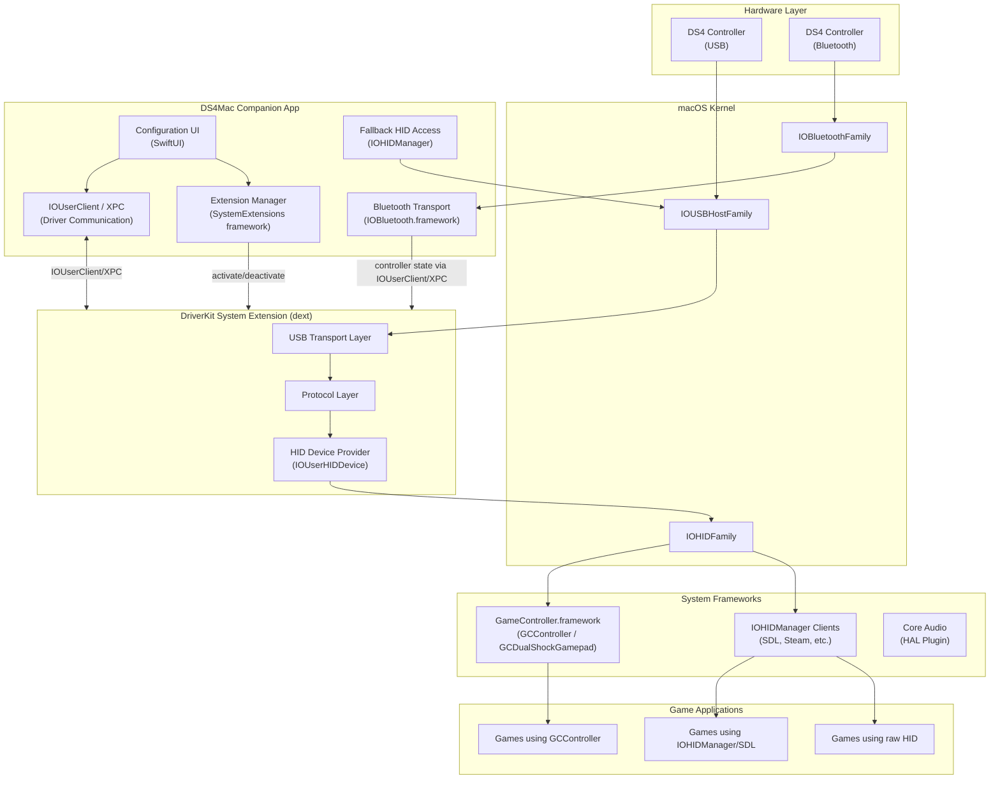
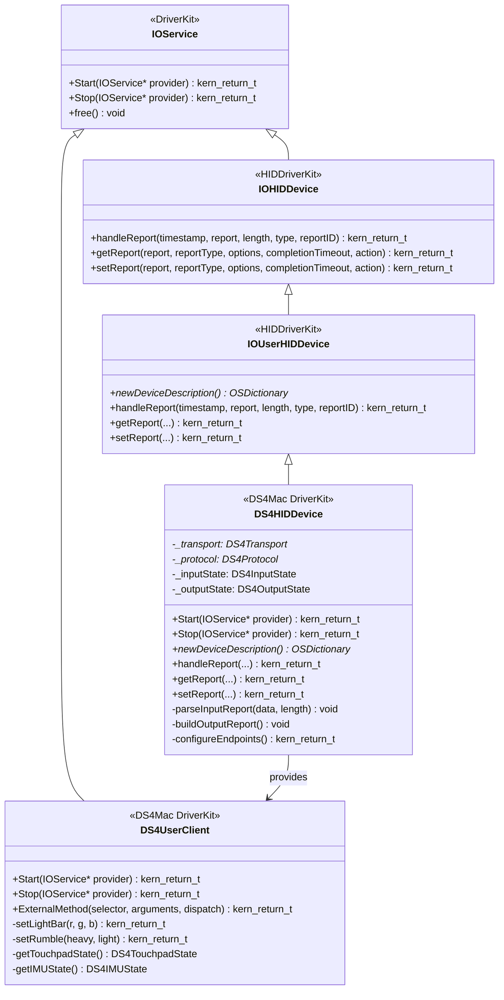
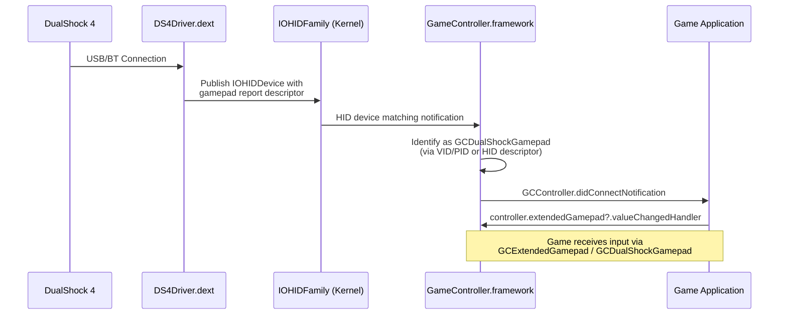
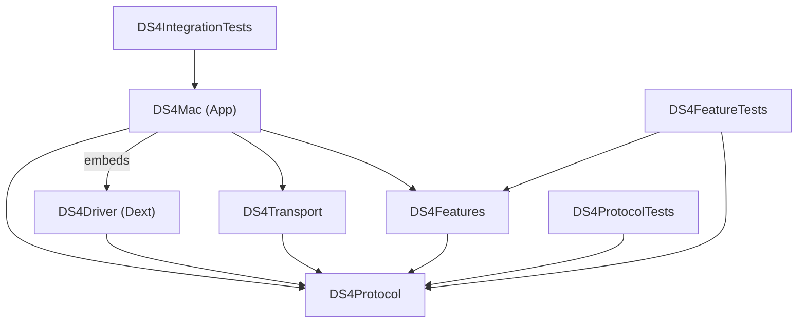
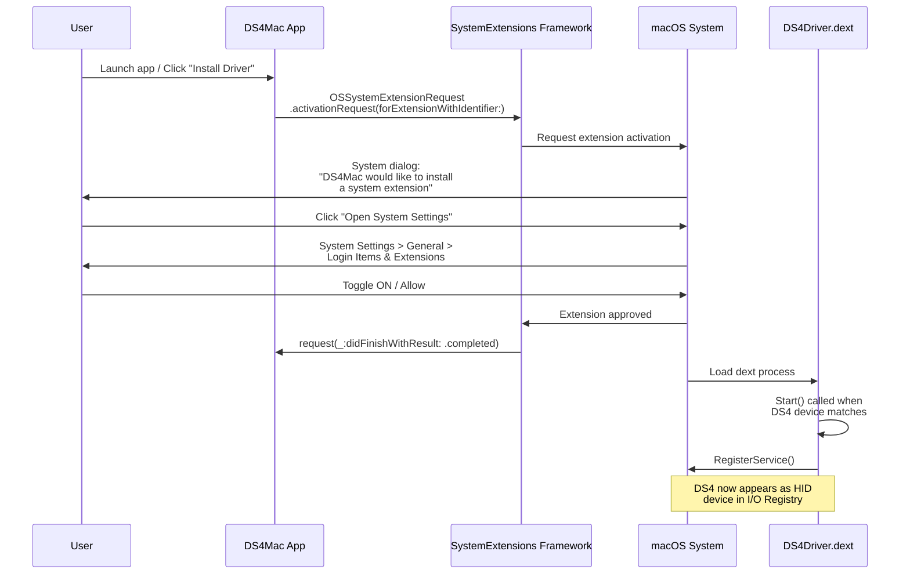
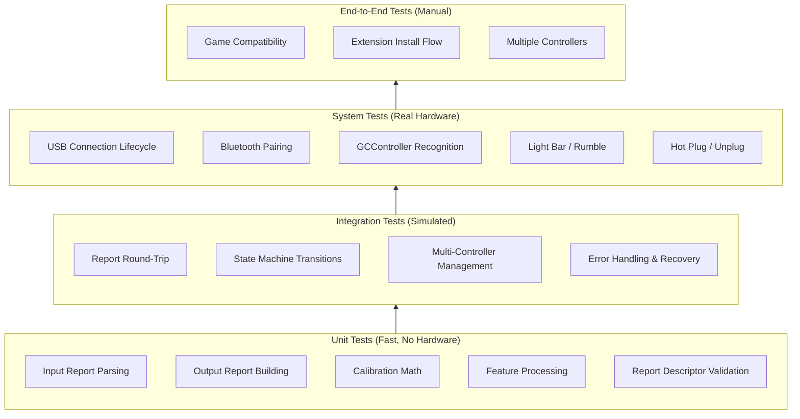
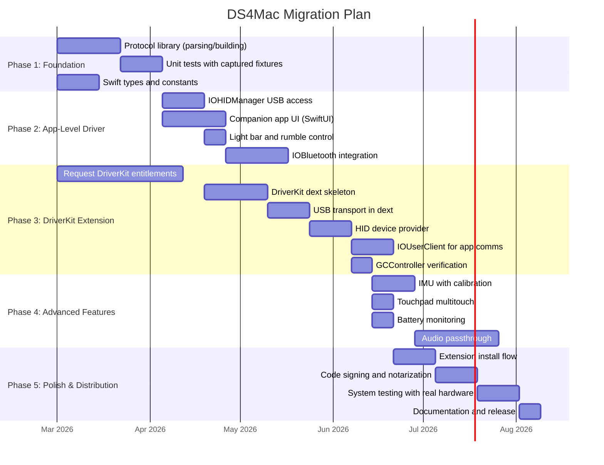

# macOS Driver Architecture for DS4Mac

> **Document Version:** 1.0
> **Last Updated:** 2026-02-27
> **Status:** Architecture Blueprint
> **Scope:** Complete modernization of the DualShock 4 driver from legacy IOKit KEXT to modern macOS architecture
>
> **Cross-References:** [02-Core-Bluetooth-APIs](./02-Core-Bluetooth-APIs.md) | [03-USB-Driver-APIs](./03-USB-Driver-APIs.md) | [04-DS4-USB-Protocol](./04-DS4-USB-Protocol.md) | [05-DS4-Bluetooth-Protocol](./05-DS4-Bluetooth-Protocol.md)

---

## Table of Contents

1. [Architecture Decision: DriverKit vs IOKit vs App-Level](#1-architecture-decision-driverkit-vs-iokit-vs-app-level)
2. [Recommended Architecture](#2-recommended-architecture)
3. [DriverKit System Extension Approach](#3-driverkit-system-extension-approach)
4. [App-Level Approach](#4-app-level-approach)
5. [GameController Framework Integration](#5-gamecontroller-framework-integration)
6. [Project Structure](#6-project-structure)
7. [Build and Distribution](#7-build-and-distribution)
8. [Testing Strategy](#8-testing-strategy)
9. [Migration Plan](#9-migration-plan)

---

## 1. Architecture Decision: DriverKit vs IOKit vs App-Level

### 1.1 Current Legacy Architecture

The existing DS4 driver (`DS4/DS4.cpp`, `DS4/DS4.h`) is a **kernel extension (KEXT)** built with IOKit. It subclasses `IOHIDDevice` and `IOService`, running inside the macOS kernel with full kernel privileges. Key characteristics of the existing code:

- **`SonyPlaystationDualShock4`** extends `IOHIDDevice` -- provides a custom HID report descriptor for the DS4 gamepad
- **`DS4Service`** extends `IOService` -- a basic IOService lifecycle handler
- **`dualshock4hid.h`** -- a static HID report descriptor byte array defining the DS4's input/output/feature reports
- **`Info.plist`** -- declares `CFBundlePackageType` as `KEXT`, matches on `IOUSBDevice` with `idVendor=1356` (0x054C, Sony) and `idProduct=1476` (0x05C4, DS4 V1)

This architecture is **deprecated by Apple** and will not load on modern macOS versions without disabling System Integrity Protection (SIP). It must be replaced.

### 1.2 Decision Matrix

| Criterion | DriverKit System Extension | IOKit KEXT (Legacy) | App-Level (IOHIDManager / IOUSBHost) |
|---|---|---|---|
| **Runs in** | User space (isolated process) | Kernel space | User space (app process) |
| **macOS Support** | macOS 10.15+ (required path forward) | Deprecated; blocked on Apple Silicon by default | macOS 10.15+ |
| **System-wide** | Yes -- all apps see the device | Yes | No -- only the running app |
| **Crash Impact** | Driver process restarts; system stable | Kernel panic possible | App crashes; system stable |
| **GameController Integration** | Full -- exposes as HID device to GCController | Full | Partial -- requires snapshot workarounds |
| **Bluetooth Support** | Via companion app using IOBluetooth.framework (dext cannot access IOBluetooth); state forwarded via IOUserClient/XPC | Via IOBluetoothHIDDriver | Via IOBluetooth framework |
| **Code Signing** | Requires DriverKit entitlements from Apple | Requires kext signing certificate | Standard Developer ID |
| **Distribution** | Notarized app + System Extension | Notarized KEXT (restricted) | Standard app distribution |
| **Apple Review** | Entitlement request required | No longer granted for new KEXTs | No special entitlements |
| **Development Complexity** | Medium -- C++ with .iig interfaces | High -- kernel debugging | Low -- Swift/ObjC user-space APIs |
| **Debugging** | Standard user-space debugging (lldb) | Kernel debugging (two-machine setup) | Standard app debugging |
| **Feature Access** | Full USB/HID control, report interception | Full kernel-level access | HID reports, limited USB control |
| **Audio Passthrough** | Via AudioDriverKit (macOS 12+) | Via IOAudioFamily | Via Core Audio HAL plugin |
| **Future-Proof** | Apple's designated replacement | Being phased out | Limited scope, but stable |

### 1.3 Recommendation: Hybrid Architecture

**Primary: DriverKit System Extension** for system-wide gamepad support, with an **App-Level companion** for configuration UI and as a fallback path during development.

**Rationale:**

1. **DriverKit is mandatory for the future.** Apple has made clear that IOKit KEXTs are being phased out. On Apple Silicon Macs, third-party KEXTs require reduced security settings. DriverKit is the only supported path for new driver development.

2. **System-wide visibility is essential for a gamepad driver.** A DS4 driver must present the controller to all applications -- not just one app. DriverKit System Extensions run as system-level daemons and expose HID devices that appear in the I/O Registry, making them visible to every application including the GameController framework (`GCController`).

3. **The app-level approach provides a rapid development path.** During the entitlement approval process (which can take weeks), development can proceed using `IOHIDManager` for USB and `IOBluetooth` for Bluetooth. This code becomes the test harness and configuration UI for the DriverKit extension.

4. **The hybrid approach maximizes compatibility.** The app-level layer can serve as a fallback for users who cannot or will not approve a System Extension.

---

## 2. Recommended Architecture

### 2.1 High-Level Architecture Diagram



> **Important:** DriverKit extensions cannot access IOBluetooth.framework. Bluetooth HID is handled by the companion app, which communicates controller state to the dext via IOUserClient/XPC.

### 2.2 Layered Architecture

The driver is organized into four distinct layers, each with a clear responsibility:

```mermaid
graph LR
    subgraph Layer1["Layer 1: Transport"]
        USB["USB Transport<br/>IOUserUSBHostDevice<br/>(in dext)"]
        BT["Bluetooth Transport<br/>IOBluetooth.framework<br/>(in companion app)"]
    end

    subgraph Layer2["Layer 2: Protocol"]
        PARSER["Report Parser"]
        BUILDER["Report Builder"]
        CALIBRATION["Calibration Data"]
        AUTH["Authentication<br/>(Bluetooth)"]
    end

    subgraph Layer3["Layer 3: Features"]
        GAMEPAD["Gamepad<br/>(Sticks, Buttons, Triggers)"]
        TOUCHPAD["Touchpad<br/>(2-point multitouch)"]
        IMU["IMU<br/>(Gyro + Accelerometer)"]
        LIGHTBAR["Light Bar<br/>(RGB LED)"]
        RUMBLE["Rumble<br/>(Dual actuator)"]
        BATTERY["Battery<br/>(Level + Charging)"]
        AUDIO["Audio<br/>(Speaker + Mic)"]
    end

    subgraph Layer4["Layer 4: Integration"]
        HID_OUT["HID Device<br/>(IOUserHIDDevice)"]
        GC_BRIDGE["GCController Bridge"]
        AUDIO_HAL["Core Audio HAL"]
        USER_CLIENT["IOUserClient<br/>(App Communication)"]
    end

    Layer1 --> Layer2
    Layer2 --> Layer3
    Layer3 --> Layer4
```



### 2.3 Layer Responsibilities

#### Layer 1: Transport

Handles the physical connection to the DS4 controller. Abstracts USB and Bluetooth into a uniform interface.

| Component | Responsibility |
|---|---|
| **USBTransport** (in dext) | Opens USB interface, configures endpoints, manages interrupt IN/OUT pipes for report I/O |
| **BluetoothTransport** (in companion app) | Manages L2CAP or HID-over-Bluetooth connection, handles pairing and authentication. Runs in the companion app because DriverKit extensions cannot access IOBluetooth.framework. Forwards controller state to the dext via IOUserClient/XPC. |
| **TransportProtocol** | Common Swift protocol that both transports conform to: `sendReport(_:)`, `onReportReceived(_:)` |

#### Layer 2: Protocol

Parses raw HID reports from the DS4 into structured data and constructs output reports.

| Component | Responsibility |
|---|---|
| **DS4InputReportParser** | Parses the 64-byte USB input report (Report ID 0x01) or 78-byte BT report (Report ID 0x11) into a `DS4InputState` struct |
| **DS4OutputReportBuilder** | Constructs output report (Report ID 0x05 USB / 0x11 BT) with rumble, light bar, and audio settings |
| **DS4CalibrationData** | Reads and applies IMU calibration from Feature Report 0x02 |
| **DS4AuthHandler** | Manages the challenge-response authentication required for Bluetooth connections |

#### Layer 3: Features

Each DS4 feature is encapsulated in its own module, receiving parsed input state and producing output state.

| Feature | Input | Output |
|---|---|---|
| **Gamepad** | Left/right stick (X,Y,Z,Rz), D-pad (hat switch), 14 buttons, L2/R2 triggers (Rx, Ry) | N/A (read-only) |
| **Touchpad** | 2-point multitouch with X/Y coordinates, touch ID, active state | N/A (read-only) |
| **IMU** | 3-axis gyroscope, 3-axis accelerometer (calibrated) | N/A (read-only) |
| **Light Bar** | N/A | RGB color (0-255 per channel), flash on/off duration |
| **Rumble** | N/A | Left motor (heavy), right motor (light), 0-255 intensity |
| **Battery** | Battery level (0-8 on battery / 0-11 when charging), charging status, cable state | N/A (read-only) |
| **Audio** | Microphone audio stream | Speaker audio stream, volume, gain |

#### Layer 4: Integration

Exposes the parsed DS4 data to the rest of macOS.

| Component | Responsibility |
|---|---|
| **IOUserHIDDevice** | The DriverKit HID device provider. Publishes a HID report descriptor and handles `handleReport`/`getReport`/`setReport` |
| **GCController Bridge** | By publishing a standard gamepad HID descriptor, the GameController framework automatically recognizes the DS4 as a `GCDualShockGamepad` |
| **Core Audio HAL Plugin** | Exposes the DS4's speaker and microphone as a Core Audio device |
| **IOUserClient** | Provides an XPC-based communication channel between the dext and the companion app for configuration (light bar color, rumble patterns, touchpad mode) |

---

## 3. DriverKit System Extension Approach

### 3.1 Project Structure

A DriverKit System Extension is delivered inside a host application. The `.dext` bundle is embedded within the app's `Contents/Library/SystemExtensions/` directory.

```
DS4Mac.app/
  Contents/
    Info.plist                              (Host app Info.plist)
    MacOS/
      DS4Mac                                (Host app binary)
    Library/
      SystemExtensions/
        com.ds4mac.driver.DS4Driver.dext/   (Driver Extension bundle)
          Info.plist                         (Dext Info.plist with IOKit matching)
          MacOS/
            com.ds4mac.driver.DS4Driver      (Dext binary)
```

### 3.2 Required Entitlements

#### Host App Entitlements (`DS4Mac.entitlements`)

```xml
<?xml version="1.0" encoding="UTF-8"?>
<!DOCTYPE plist PUBLIC "-//Apple//DTD PLIST 1.0//EN"
  "http://www.apple.com/DTDs/PropertyList-1.0.dtd">
<plist version="1.0">
<dict>
    <!-- Required to use SystemExtensions framework -->
    <key>com.apple.developer.system-extension.install</key>
    <true/>

    <!-- App sandbox (recommended for distribution) -->
    <key>com.apple.security.app-sandbox</key>
    <true/>

    <!-- USB device access for fallback/config mode -->
    <key>com.apple.security.device.usb</key>
    <true/>

    <!-- Bluetooth access for fallback/config mode -->
    <key>com.apple.security.device.bluetooth</key>
    <true/>
</dict>
</plist>
```

#### Driver Extension Entitlements (`DS4Driver.entitlements`)

```xml
<?xml version="1.0" encoding="UTF-8"?>
<!DOCTYPE plist PUBLIC "-//Apple//DTD PLIST 1.0//EN"
  "http://www.apple.com/DTDs/PropertyList-1.0.dtd">
<plist version="1.0">
<dict>
    <!-- DriverKit base entitlement -->
    <key>com.apple.developer.driverkit</key>
    <true/>

    <!-- Allow the dext to communicate with IOUSBHost family -->
    <key>com.apple.developer.driverkit.family.hid.device</key>
    <true/>

    <!-- Allow matching on specific USB transport -->
    <key>com.apple.developer.driverkit.transport.usb</key>
    <array>
        <!-- Sony Corp. DS4 V1: VID 0x054C, PID 0x05C4 -->
        <dict>
            <key>idVendor</key>
            <integer>1356</integer>
            <key>idProduct</key>
            <integer>1476</integer>
        </dict>
        <!-- Sony Corp. DS4 V2: VID 0x054C, PID 0x09CC -->
        <dict>
            <key>idVendor</key>
            <integer>1356</integer>
            <key>idProduct</key>
            <integer>2508</integer>
        </dict>
    </array>

    <!-- Allow the dext to provide HID services -->
    <key>com.apple.developer.driverkit.family.hid.eventservice</key>
    <true/>

    <!-- Allow communication with the companion app -->
    <key>com.apple.developer.driverkit.userclient-access</key>
    <array>
        <string>com.ds4mac.app</string>
    </array>
</dict>
</plist>
```

> **Important:** You must request these entitlements from Apple through the [DriverKit entitlement request process](https://developer.apple.com/documentation/driverkit/requesting-entitlements-for-driverkit-development). During development with SIP disabled, you can use `systemextensionsctl developer on` to bypass entitlement validation.

### 3.3 Info.plist Configuration for USB Matching

#### Driver Extension Info.plist

```xml
<?xml version="1.0" encoding="UTF-8"?>
<!DOCTYPE plist PUBLIC "-//Apple//DTD PLIST 1.0//EN"
  "http://www.apple.com/DTDs/PropertyList-1.0.dtd">
<plist version="1.0">
<dict>
    <key>CFBundleDevelopmentRegion</key>
    <string>en</string>
    <key>CFBundleExecutable</key>
    <string>$(EXECUTABLE_NAME)</string>
    <key>CFBundleIdentifier</key>
    <string>com.ds4mac.driver.DS4Driver</string>
    <key>CFBundleInfoDictionaryVersion</key>
    <string>6.0</string>
    <key>CFBundleName</key>
    <string>DS4Driver</string>
    <key>CFBundlePackageType</key>
    <string>DEXT</string>
    <key>CFBundleShortVersionString</key>
    <string>1.0</string>
    <key>CFBundleVersion</key>
    <string>1</string>

    <key>IOKitPersonalities</key>
    <dict>
        <!-- DS4 V1 (CUH-ZCT1x) USB Matching -->
        <key>DS4_V1_USB</key>
        <dict>
            <key>CFBundleIdentifier</key>
            <string>com.ds4mac.driver.DS4Driver</string>
            <key>IOClass</key>
            <string>AppleUserUSBHostHIDDevice</string>
            <key>IOProviderClass</key>
            <string>IOUSBHostInterface</string>
            <key>IOUserClass</key>
            <string>DS4HIDDevice</string>
            <key>IOUserServerName</key>
            <string>com.ds4mac.driver.DS4Driver</string>
            <key>idVendor</key>
            <integer>1356</integer>
            <key>idProduct</key>
            <integer>1476</integer>
            <key>bInterfaceNumber</key>
            <integer>0</integer>
        </dict>

        <!-- DS4 V2 (CUH-ZCT2x) USB Matching -->
        <key>DS4_V2_USB</key>
        <dict>
            <key>CFBundleIdentifier</key>
            <string>com.ds4mac.driver.DS4Driver</string>
            <key>IOClass</key>
            <string>AppleUserUSBHostHIDDevice</string>
            <key>IOProviderClass</key>
            <string>IOUSBHostInterface</string>
            <key>IOUserClass</key>
            <string>DS4HIDDevice</string>
            <key>IOUserServerName</key>
            <string>com.ds4mac.driver.DS4Driver</string>
            <key>idVendor</key>
            <integer>1356</integer>
            <key>idProduct</key>
            <integer>2508</integer>
            <key>bInterfaceNumber</key>
            <integer>0</integer>
        </dict>
    </dict>
</dict>
</plist>
```

**Matching Key Reference:**

| Key | Value | Purpose |
|---|---|---|
| `IOClass` | `AppleUserUSBHostHIDDevice` | Kernel-side proxy class that bridges to user-space DriverKit |
| `IOProviderClass` | `IOUSBHostInterface` | Match against a USB interface (not the device as a whole) |
| `IOUserClass` | `DS4HIDDevice` | Your DriverKit C++ class that will be instantiated |
| `IOUserServerName` | `com.ds4mac.driver.DS4Driver` | Bundle identifier of the dext |
| `idVendor` | `1356` (0x054C) | Sony Corporation USB Vendor ID |
| `idProduct` | `1476` (0x05C4) or `2508` (0x09CC) | DS4 V1 or V2 USB Product ID |
| `bInterfaceNumber` | `0` | HID interface index on the DS4 composite USB device |

### 3.4 Driver Class Hierarchy



### 3.5 Driver Extension Implementation Skeleton

#### DS4HIDDevice.iig (Interface Definition)

```cpp
#ifndef DS4HIDDevice_h
#define DS4HIDDevice_h

#include <Availability.h>
#include <DriverKit/IOService.iig>
#include <HIDDriverKit/IOUserHIDDevice.iig>

class DS4HIDDevice: public IOUserHIDDevice
{
public:
    // Lifecycle
    virtual bool init() override;
    virtual kern_return_t Start(IOService * provider) override;
    virtual kern_return_t Stop(IOService * provider) override;
    virtual void free() override;

    // HID Device Provider
    virtual OSDictionary * newDeviceDescription() override;
    virtual OSData * newReportDescriptor() override;

    // Report handling
    virtual kern_return_t getReport(IOMemoryDescriptor      * report,
                                     IOHIDReportType          reportType,
                                     IOOptionBits             options,
                                     uint32_t                 completionTimeout,
                                     OSAction               * action) override;

    virtual kern_return_t setReport(IOMemoryDescriptor      * report,
                                     IOHIDReportType          reportType,
                                     IOOptionBits             options,
                                     uint32_t                 completionTimeout,
                                     OSAction               * action) override;

    // Input report callback (called when USB interrupt IN completes)
    virtual void inputReportComplete(OSAction    * action,
                                      IOReturn     status,
                                      uint32_t     actualByteCount)
                     TYPE(IOUSBHostPipe::CompleteAsyncIO);

private:
    // Internal methods
    kern_return_t configureDevice();
    kern_return_t startInputPolling();
    void          processInputReport(const uint8_t * data, uint32_t length);
    kern_return_t sendOutputReport();
};

#endif /* DS4HIDDevice_h */
```

#### DS4HIDDevice.cpp (Implementation Outline)

```cpp
#include <os/log.h>
#include <DriverKit/IOLib.h>
#include <DriverKit/IOMemoryDescriptor.h>
#include <DriverKit/OSData.h>
#include <DriverKit/OSDictionary.h>
#include <USBDriverKit/IOUSBHostDevice.h>
#include <USBDriverKit/IOUSBHostInterface.h>
#include <USBDriverKit/IOUSBHostPipe.h>
#include <HIDDriverKit/IOUserHIDDevice.h>

#include "DS4HIDDevice.h"
#include "DS4ReportDescriptor.h"
#include "DS4Protocol.h"

struct DS4HIDDevice_IVars {
    IOUSBHostInterface * interface;
    IOUSBHostPipe      * inPipe;
    IOUSBHostPipe      * outPipe;
    IOBufferMemoryDescriptor * inBuffer;
    IOBufferMemoryDescriptor * outBuffer;
    OSAction           * inputAction;

    DS4InputState        inputState;
    DS4OutputState       outputState;

    uint8_t              deviceVersion;  // 1 = CUH-ZCT1x, 2 = CUH-ZCT2x
};

bool DS4HIDDevice::init()
{
    if (!super::init()) return false;

    ivars = IONewZero(DS4HIDDevice_IVars, 1);
    if (!ivars) return false;

    return true;
}

kern_return_t DS4HIDDevice::Start(IOService * provider)
{
    kern_return_t ret;

    ret = super::Start(provider);
    if (ret != kIOReturnSuccess) return ret;

    // Cast provider to IOUSBHostInterface
    ivars->interface = OSDynamicCast(IOUSBHostInterface, provider);
    if (!ivars->interface) return kIOReturnNoDevice;
    ivars->interface->retain();

    // Configure USB endpoints and start polling
    ret = configureDevice();
    if (ret != kIOReturnSuccess) return ret;

    ret = startInputPolling();
    if (ret != kIOReturnSuccess) return ret;

    // Register as a HID device provider
    RegisterService();

    os_log(OS_LOG_DEFAULT, "DS4Mac: DualShock 4 driver started successfully");
    return kIOReturnSuccess;
}

kern_return_t DS4HIDDevice::Stop(IOService * provider)
{
    os_log(OS_LOG_DEFAULT, "DS4Mac: DualShock 4 driver stopping");

    // Clean up pipes, buffers, and actions
    OSSafeReleaseNULL(ivars->inPipe);
    OSSafeReleaseNULL(ivars->outPipe);
    OSSafeReleaseNULL(ivars->inBuffer);
    OSSafeReleaseNULL(ivars->outBuffer);
    OSSafeReleaseNULL(ivars->inputAction);
    OSSafeReleaseNULL(ivars->interface);

    return super::Stop(provider);
}

void DS4HIDDevice::free()
{
    IOSafeDeleteNULL(ivars, DS4HIDDevice_IVars, 1);
    super::free();
}

OSDictionary * DS4HIDDevice::newDeviceDescription()
{
    // Return device properties for HID registration
    auto dict = OSDictionary::withCapacity(8);
    // Populate: kIOHIDVendorIDKey, kIOHIDProductIDKey, kIOHIDTransportKey, etc.
    // See Section 3.6 for complete property list
    return dict;
}

OSData * DS4HIDDevice::newReportDescriptor()
{
    // Return the HID report descriptor that describes the DS4 as a gamepad
    return OSData::withBytes(DS4ReportDescriptor,
                              sizeof(DS4ReportDescriptor));
}
```

### 3.6 IOService Matching for DS4 VID/PID

The DualShock 4 has the following USB identifiers:

| Model | USB VID | USB PID | Decimal VID | Decimal PID | Notes |
|---|---|---|---|---|---|
| DS4 V1 (CUH-ZCT1x) | 0x054C | 0x05C4 | 1356 | 1476 | Original model |
| DS4 V2 (CUH-ZCT2x) | 0x054C | 0x09CC | 1356 | 2508 | Slim/Pro era revision |

**Bluetooth identifiers** (for Bluetooth matching, when supported):

| Model | BT VID | BT PID |
|---|---|---|
| DS4 V1 | 0x054C | 0x05C4 |
| DS4 V2 | 0x054C | 0x09CC |

The existing legacy `Info.plist` only matches V1 (`idProduct=1476`). The modernized driver must match both.

**Verification with ioreg:**

```bash
# Find connected DS4 controllers in the I/O Registry
ioreg -r -c IOUSBHostDevice -l | grep -A 10 "054c"

# Alternatively, use system_profiler
system_profiler SPUSBDataType | grep -A 5 -i "wireless controller"
```

---

## 4. App-Level Approach

The app-level approach uses user-space frameworks to communicate with the DS4 directly from the companion application. This is useful for:

- **Development and testing** before DriverKit entitlements are approved
- **Configuration UI** (light bar color picker, rumble testing, button remapping)
- **Fallback** on systems where the user hasn't approved the System Extension

### 4.1 Using IOHIDManager for HID Access

`IOHIDManager` is the primary user-space API for accessing HID devices on macOS. It is part of the IOKit framework but runs entirely in user space.

```swift
import IOKit.hid

class DS4HIDManagerAccess {
    private var hidManager: IOHIDManager?

    // DS4 device identifiers
    static let sonyVendorID: Int = 0x054C
    static let ds4V1ProductID: Int = 0x05C4
    static let ds4V2ProductID: Int = 0x09CC

    func startMonitoring() {
        hidManager = IOHIDManagerCreate(kCFAllocatorDefault,
                                         IOOptionBits(kIOHIDOptionsTypeNone))

        // Create matching dictionaries for both DS4 versions
        let matchingDicts: [[String: Any]] = [
            [
                kIOHIDVendorIDKey as String: Self.sonyVendorID,
                kIOHIDProductIDKey as String: Self.ds4V1ProductID
            ],
            [
                kIOHIDVendorIDKey as String: Self.sonyVendorID,
                kIOHIDProductIDKey as String: Self.ds4V2ProductID
            ]
        ]

        IOHIDManagerSetDeviceMatchingMultiple(hidManager!,
                                               matchingDicts as CFArray)

        // Register callbacks
        IOHIDManagerRegisterDeviceMatchingCallback(
            hidManager!, deviceConnected, nil)
        IOHIDManagerRegisterDeviceRemovalCallback(
            hidManager!, deviceDisconnected, nil)
        IOHIDManagerRegisterInputReportCallback(
            hidManager!, inputReportReceived, nil)

        IOHIDManagerScheduleWithRunLoop(
            hidManager!,
            CFRunLoopGetCurrent(),
            CFRunLoopMode.defaultMode.rawValue)

        IOHIDManagerOpen(hidManager!, IOOptionBits(kIOHIDOptionsTypeNone))
    }

    // Callback: DS4 connected
    private let deviceConnected: IOHIDDeviceCallback = {
        context, result, sender, device in
        print("DS4 connected: \(device)")
        // Begin reading input reports
    }

    // Callback: DS4 disconnected
    private let deviceDisconnected: IOHIDDeviceCallback = {
        context, result, sender, device in
        print("DS4 disconnected")
    }

    // Callback: Input report received (~250Hz)
    private let inputReportReceived: IOHIDReportCallback = {
        context, result, sender, reportType,
        reportID, report, reportLength in
        // Parse the 64-byte input report
        // report[0]  = left stick X
        // report[1]  = left stick Y
        // report[2]  = right stick X
        // report[3]  = right stick Y
        // report[4]  = buttons (hat + face)
        // report[5]  = buttons (shoulder + misc)
        // report[6]  = counter + L2/R2
        // report[7]  = L2 analog
        // report[8]  = R2 analog
        // report[9..12]  = timestamp
        // report[13] = battery + connection
        // report[14..19] = gyro (3 x int16)
        // report[20..25] = accel (3 x int16)
        // report[33..36] = touchpad point 1
        // report[37..40] = touchpad point 2
    }

    /// Send an output report (light bar, rumble)
    func sendOutputReport(device: IOHIDDevice,
                           rumbleHeavy: UInt8,
                           rumbleLight: UInt8,
                           ledRed: UInt8,
                           ledGreen: UInt8,
                           ledBlue: UInt8) {
        var report = [UInt8](repeating: 0, count: 32)
        report[0] = 0x05  // Report ID
        report[1] = 0xFF  // Enable flags
        report[4] = rumbleLight
        report[5] = rumbleHeavy
        report[6] = ledRed
        report[7] = ledGreen
        report[8] = ledBlue

        IOHIDDeviceSetReport(device,
                              kIOHIDReportTypeOutput,
                              CFIndex(0x05),
                              report,
                              report.count)
    }
}
```

> **Permission Note:** On macOS 10.15+, accessing HID devices via `IOHIDManager` requires the "Input Monitoring" privacy permission. Your app must include `NSInputMonitoringUsageDescription` in its `Info.plist`, and the user must grant the permission in System Settings > Privacy & Security > Input Monitoring.

### 4.2 Using IOUSBHost for Raw USB Access

For lower-level USB control beyond HID (e.g., reading calibration feature reports, USB audio endpoints), the `IOUSBHost` framework provides direct USB device access.

```swift
import IOUSBHost

class DS4USBAccess {
    private var device: IOUSBHostObject?

    func openDS4() throws {
        // Create a matching dictionary
        let matching = IOUSBHostDevice.createMatchingDictionary(
            vendorID: 0x054C,
            productID: 0x05C4,
            bcdDevice: nil,
            deviceClass: nil,
            deviceSubclass: nil,
            deviceProtocol: nil,
            speed: nil,
            productIDArray: nil
        )

        // Get the service from IOKit
        var iterator: io_iterator_t = 0
        let result = IOServiceGetMatchingServices(
            kIOMainPortDefault, matching, &iterator)

        guard result == KERN_SUCCESS else {
            throw DS4Error.deviceNotFound
        }

        // Use IOUSBHostDevice to open the interface
        // and access endpoints for bulk/interrupt transfers
    }

    /// Read IMU calibration data (Feature Report 0x02)
    func readCalibrationData(device: IOHIDDevice) -> DS4CalibrationData? {
        var reportData = [UInt8](repeating: 0, count: 37)
        var reportLength = reportData.count

        let result = IOHIDDeviceGetReport(
            device,
            kIOHIDReportTypeFeature,
            CFIndex(0x02),
            &reportData,
            &reportLength)

        guard result == kIOReturnSuccess else { return nil }

        // Parse calibration: gyro pitch/yaw/roll bias and scale,
        // accelerometer X/Y/Z bias and scale
        return DS4CalibrationData(rawData: reportData)
    }
}
```

### 4.3 Using IOBluetooth for Bluetooth Connection

Bluetooth DS4 connections use the L2CAP protocol. The controller appears as a Bluetooth HID device.

```swift
import IOBluetooth

class DS4BluetoothAccess: NSObject, IOBluetoothDeviceInquiryDelegate {
    private var inquiry: IOBluetoothDeviceInquiry?

    func startDiscovery() {
        inquiry = IOBluetoothDeviceInquiry(delegate: self)
        inquiry?.updateNewDeviceNames = true
        inquiry?.start()
    }

    func deviceInquiryDeviceFound(
        _ sender: IOBluetoothDeviceInquiry,
        device: IOBluetoothDevice
    ) {
        // Check if this is a DS4 by name or device class
        if device.name?.contains("Wireless Controller") == true {
            connectToDS4(device)
        }
    }

    private func connectToDS4(_ device: IOBluetoothDevice) {
        // Open L2CAP channels for HID Control (PSM 0x0011)
        // and HID Interrupt (PSM 0x0013)
        // Bluetooth DS4 reports use Report ID 0x11 (extended format)
        // and require CRC-32 authentication
    }
}
```

### 4.4 Comparison: DriverKit vs App-Level

| Aspect | DriverKit System Extension | App-Level (IOHIDManager + IOUSBHost) |
|---|---|---|
| **Visibility** | System-wide; all apps see the controller | Only the running app has access |
| **GameController.framework** | Automatic GCDualShockGamepad recognition | Must use GCController snapshots (workaround) |
| **Persistence** | Runs as long as the device is connected | Runs only while the app is open |
| **Multiple Controllers** | Handles all connected DS4s | Handles all connected DS4s |
| **Privileged Operations** | Full HID report interception and rewriting | Read/write HID reports only |
| **Apple Approval** | Requires DriverKit entitlements | Standard code signing |
| **Development Speed** | Slower (C++, .iig, provisioning) | Faster (Swift, standard APIs) |
| **Debugging** | lldb attach to dext process | Standard Xcode debugging |

---

## 5. GameController Framework Integration

### 5.1 How GCController Discovers Devices

The `GameController` framework (`GCController`) automatically discovers game controllers connected to the system. It does this by monitoring the HID subsystem for devices that match known gamepad profiles.



### 5.2 Native DS4 Support in GameController

Starting with **macOS 10.15 Catalina**, Apple added native DualShock 4 support to the GameController framework. The `GCDualShockGamepad` profile provides:

- All standard extended gamepad inputs (sticks, D-pad, buttons, triggers, shoulders)
- **Touchpad button** (press) as an additional input
- Positional button mapping (Cross = buttonA, Circle = buttonB, etc.)

**What Apple's native support does NOT provide:**

- Touchpad multitouch coordinates
- IMU (gyroscope / accelerometer) data
- Light bar color control
- Rumble/haptic control (beyond basic GCHapticsEngine on newer OS versions)
- Battery level monitoring
- Audio routing (speaker/microphone)

### 5.3 Integration Strategy

Our driver should **enhance, not replace** Apple's native support. The strategy:

1. **For standard gamepad input:** Let Apple's built-in HID-to-GCController path handle it. Our driver publishes a compliant HID report descriptor that the GameController framework recognizes as `GCDualShockGamepad`.

2. **For advanced features (touchpad, IMU, light bar, rumble, audio):** Provide these through the companion app's IOUserClient connection and a public Swift framework.

3. **For the GCController extensible input API:** Use `GCPhysicalInputProfile` (available macOS 13+) to expose non-standard inputs like the touchpad X/Y coordinates and IMU data to games that query for them.

```swift
import GameController

class DS4GameControllerBridge {
    func setupControllerMonitoring() {
        NotificationCenter.default.addObserver(
            forName: .GCControllerDidConnect,
            object: nil, queue: .main
        ) { notification in
            guard let controller = notification.object as? GCController else {
                return
            }

            // Check if this is a DualShock 4
            if let ds4 = controller.physicalInputProfile
                as? GCDualShockGamepad {
                self.configureDS4(controller: controller, profile: ds4)
            }
        }

        // Start discovery
        GCController.startWirelessControllerDiscovery()
    }

    private func configureDS4(controller: GCController,
                                profile: GCDualShockGamepad) {
        // Standard gamepad input handling
        profile.valueChangedHandler = { gamepad, element in
            // Handle button/stick changes
        }

        // Access touchpad button (native support)
        profile.touchpadButton.valueChangedHandler = { button, value, pressed in
            // Touchpad press
        }

        // For advanced features, communicate with our dext
        // via the companion app's XPC service
    }
}
```

### 5.4 HID Report Descriptor Design for GCController Compatibility

The report descriptor published by our DriverKit extension must be carefully designed so that the GameController framework correctly identifies the device as a DualShock 4 gamepad. Key requirements:

- **Usage Page:** Generic Desktop (0x01)
- **Usage:** Game Pad (0x05)
- **Standard Inputs:** Left stick (X, Y), Right stick (Z, Rz), Hat switch (D-pad), 14+ buttons, L2/R2 analog triggers (Rx, Ry)
- **Vendor ID / Product ID:** Must report as Sony (0x054C) with the correct product ID so that GCController instantiates `GCDualShockGamepad` specifically

The existing `dualshock4hid.h` report descriptor from the legacy driver already defines this structure and can be reused with minor modifications for the DriverKit version.

---

## 6. Project Structure

### 6.1 Recommended Directory Layout

```
ds4mac/
+-- DS4Mac.xcodeproj/                      # Xcode project (multi-target)
+-- DS4Mac.xcworkspace/                     # Workspace (if using SPM packages)
|
+-- Sources/
|   +-- DS4Mac/                             # Companion App (macOS, SwiftUI)
|   |   +-- App/
|   |   |   +-- DS4MacApp.swift             # App entry point
|   |   |   +-- AppDelegate.swift           # NSApplicationDelegate
|   |   +-- Views/
|   |   |   +-- MainView.swift              # Main window
|   |   |   +-- ControllerView.swift        # Controller status & visualization
|   |   |   +-- LightBarView.swift          # Color picker for light bar
|   |   |   +-- RumbleView.swift            # Rumble testing controls
|   |   |   +-- SettingsView.swift          # Preferences
|   |   +-- ViewModels/
|   |   |   +-- ControllerViewModel.swift   # Controller state management
|   |   |   +-- SettingsViewModel.swift      # Settings state
|   |   +-- Services/
|   |   |   +-- ExtensionManager.swift      # SystemExtensions activation
|   |   |   +-- DriverCommunication.swift   # XPC to dext IOUserClient
|   |   |   +-- HIDFallbackService.swift    # IOHIDManager fallback
|   |   |   +-- BluetoothService.swift      # IOBluetooth discovery
|   |   +-- Resources/
|   |   |   +-- Assets.xcassets
|   |   |   +-- DS4Mac.entitlements
|   |   |   +-- Info.plist
|   |
|   +-- DS4Driver/                          # DriverKit System Extension
|   |   +-- DS4HIDDevice.iig               # IOUserHIDDevice subclass interface
|   |   +-- DS4HIDDevice.cpp               # Main driver implementation
|   |   +-- DS4UserClient.iig              # IOUserClient for app comms
|   |   +-- DS4UserClient.cpp
|   |   +-- Info.plist                      # Dext matching & config
|   |   +-- DS4Driver.entitlements
|   |
|   +-- DS4Protocol/                        # Shared Protocol Library
|   |   +-- DS4ReportDescriptor.h           # HID report descriptor bytes
|   |   +-- DS4InputReport.h                # Input report structs (C)
|   |   +-- DS4InputReport.swift            # Input report parsing (Swift)
|   |   +-- DS4OutputReport.h               # Output report structs (C)
|   |   +-- DS4OutputReport.swift           # Output report building (Swift)
|   |   +-- DS4FeatureReports.h             # Feature report definitions
|   |   +-- DS4CalibrationData.swift        # IMU calibration parsing
|   |   +-- DS4Constants.swift              # VID/PID, report IDs, sizes
|   |   +-- DS4Types.swift                  # Shared types (DS4InputState, etc.)
|   |
|   +-- DS4Transport/                       # Transport Abstraction
|   |   +-- TransportProtocol.swift         # Protocol for USB/BT abstraction
|   |   +-- USBTransport.swift              # USB-specific transport
|   |   +-- BluetoothTransport.swift        # Bluetooth-specific transport
|   |
|   +-- DS4Features/                        # Feature Modules
|   |   +-- GamepadFeature.swift            # Button/stick/trigger processing
|   |   +-- TouchpadFeature.swift           # Touchpad coordinate processing
|   |   +-- IMUFeature.swift                # Gyro/accel with calibration
|   |   +-- LightBarFeature.swift           # LED color management
|   |   +-- RumbleFeature.swift             # Haptic feedback control
|   |   +-- BatteryFeature.swift            # Battery monitoring
|   |   +-- AudioFeature.swift              # Audio routing
|
+-- Tests/
|   +-- DS4ProtocolTests/
|   |   +-- InputReportParserTests.swift    # Test report parsing with fixtures
|   |   +-- OutputReportBuilderTests.swift  # Test report construction
|   |   +-- CalibrationDataTests.swift      # Test IMU calibration math
|   |   +-- ReportDescriptorTests.swift     # Validate descriptor structure
|   +-- DS4FeatureTests/
|   |   +-- GamepadFeatureTests.swift       # Test button mapping
|   |   +-- TouchpadFeatureTests.swift      # Test touch coordinate parsing
|   |   +-- IMUFeatureTests.swift           # Test gyro/accel processing
|   +-- DS4IntegrationTests/
|   |   +-- USBConnectionTests.swift        # Integration tests with real HW
|   |   +-- HIDReportRoundTripTests.swift   # End-to-end report tests
|   +-- Fixtures/
|       +-- sample_input_report_v1.bin      # Captured DS4 V1 input report
|       +-- sample_input_report_v2.bin      # Captured DS4 V2 input report
|       +-- sample_calibration_report.bin   # Captured calibration data
|       +-- sample_bt_input_report.bin      # Captured BT input report
|
+-- docs/
|   +-- 10-macOS-Driver-Architecture.md     # This document
|
+-- Scripts/
|   +-- capture-hid-reports.py              # Utility to capture raw HID reports
|   +-- codesign.sh                         # Code signing helper
|   +-- install-dext.sh                     # Development install script
|
+-- legacy/                                 # Preserved legacy KEXT code
    +-- DS4/
        +-- DS4.cpp
        +-- DS4.h
        +-- DS4Service.cpp
        +-- DS4Service.h
        +-- dualshock4hid.h
        +-- Info.plist
```

### 6.2 Xcode Target Configuration

The Xcode project contains multiple targets:

| Target | Type | Language | Output |
|---|---|---|---|
| **DS4Mac** | macOS Application | Swift | `DS4Mac.app` |
| **DS4Driver** | DriverKit Extension | C++ (.iig/.cpp) | `com.ds4mac.driver.DS4Driver.dext` |
| **DS4Protocol** | Framework / Swift Package | Swift + C | `DS4Protocol.framework` |
| **DS4Transport** | Framework / Swift Package | Swift | `DS4Transport.framework` |
| **DS4Features** | Framework / Swift Package | Swift | `DS4Features.framework` |
| **DS4ProtocolTests** | Unit Test Bundle | Swift | Test results |
| **DS4FeatureTests** | Unit Test Bundle | Swift | Test results |
| **DS4IntegrationTests** | Unit Test Bundle | Swift | Test results |

**Target Dependencies:**



### 6.3 Swift Package Manager Consideration

The protocol, transport, and feature modules can optionally be organized as Swift packages within a workspace. However, the DriverKit extension **must** remain an Xcode target because:

- DriverKit extensions use `.iig` files processed by Apple's IIG tool, which is integrated into Xcode's build system
- DriverKit extensions require specific build settings (`SYSTEM_EXTENSION_API_USAGE = YES`)
- Provisioning profiles for dexts are managed through Xcode's signing workflow

A recommended hybrid approach: use Swift packages for the pure-Swift protocol/feature libraries, and keep the dext and app as Xcode-native targets.

---

## 7. Build and Distribution

### 7.1 Code Signing Requirements

DriverKit extensions have strict code signing requirements that differ from standard app signing.

| Component | Signing Identity | Provisioning Profile |
|---|---|---|
| **DS4Mac.app** | Developer ID Application (distribution) or Apple Development (debug) | macOS App Development / Developer ID |
| **DS4Driver.dext** | Same team as host app | **DriverKit Development** (debug) or **Developer ID** (distribution) |

**Key requirements:**

1. Both the app and dext must be signed by the **same team**.
2. The dext's bundle identifier must be a child of the app's (e.g., `com.ds4mac.app` and `com.ds4mac.driver.DS4Driver`).
3. DriverKit entitlements must be enabled on the dext's App ID in the Apple Developer portal.
4. You must create a **DriverKit development provisioning profile** specifically for the dext target.

#### Development Signing (SIP Disabled)

During development, you can bypass entitlement checks:

```bash
# Disable SIP (requires recovery mode boot)
csrutil disable

# Enable System Extension developer mode
systemextensionsctl developer on

# Now you can load dexts signed with any valid developer certificate
```

#### Production Signing

```bash
# Sign the dext
codesign --sign "Developer ID Application: Your Name (TEAMID)" \
         --entitlements DS4Driver.entitlements \
         --options runtime \
         --force \
         DS4Mac.app/Contents/Library/SystemExtensions/com.ds4mac.driver.DS4Driver.dext

# Sign the host app
codesign --sign "Developer ID Application: Your Name (TEAMID)" \
         --entitlements DS4Mac.entitlements \
         --options runtime \
         --force \
         DS4Mac.app
```

### 7.2 Notarization

All software distributed outside the Mac App Store with a Developer ID must be notarized.

```bash
# Create a ZIP for notarization submission
ditto -c -k --keepParent DS4Mac.app DS4Mac.zip

# Submit for notarization
xcrun notarytool submit DS4Mac.zip \
    --apple-id "your@email.com" \
    --team-id "TEAMID" \
    --password "@keychain:AC_PASSWORD" \
    --wait

# Staple the notarization ticket
xcrun stapler staple DS4Mac.app
```

**Notarization checks for DriverKit extensions:**
- Valid code signature with Developer ID
- Hardened runtime enabled (`--options runtime`)
- No disallowed entitlements
- No known malware signatures
- Valid DriverKit entitlements matching the provisioning profile

### 7.3 System Extension Installation Flow

The companion app is responsible for activating and deactivating the System Extension using the `SystemExtensions` framework.



#### Swift Implementation

```swift
import SystemExtensions

class ExtensionManager: NSObject, OSSystemExtensionRequestDelegate {
    private let dextIdentifier = "com.ds4mac.driver.DS4Driver"

    func activateDriver() {
        let request = OSSystemExtensionRequest.activationRequest(
            forExtensionWithIdentifier: dextIdentifier,
            queue: .main
        )
        request.delegate = self
        OSSystemExtensionManager.shared.submitRequest(request)
    }

    func deactivateDriver() {
        let request = OSSystemExtensionRequest.deactivationRequest(
            forExtensionWithIdentifier: dextIdentifier,
            queue: .main
        )
        request.delegate = self
        OSSystemExtensionManager.shared.submitRequest(request)
    }

    // MARK: - OSSystemExtensionRequestDelegate

    func request(_ request: OSSystemExtensionRequest,
                 didFinishWithResult result: OSSystemExtensionRequest.Result) {
        switch result {
        case .completed:
            print("Extension activated successfully")
        case .willCompleteAfterReboot:
            print("Extension will activate after reboot")
        @unknown default:
            print("Unknown result: \(result)")
        }
    }

    func request(_ request: OSSystemExtensionRequest,
                 didFailWithError error: Error) {
        print("Extension activation failed: \(error)")
    }

    func requestNeedsUserApproval(
        _ request: OSSystemExtensionRequest
    ) {
        // Inform user they need to approve in System Settings
        print("User approval required. Opening System Settings...")
    }

    func request(
        _ request: OSSystemExtensionRequest,
        actionForReplacingExtension existing: OSSystemExtensionProperties,
        withExtension ext: OSSystemExtensionProperties
    ) -> OSSystemExtensionRequest.ReplacementAction {
        // Allow replacing an older version with a newer one
        return .replace
    }
}
```

### 7.4 User Approval Process

On macOS 15 (Sequoia) and later, the user approval flow is:

1. App submits activation request via `OSSystemExtensionRequest`
2. macOS displays a system dialog: *"[App Name] would like to load a system extension"*
3. User clicks **"Open System Settings"** (or the dialog is dismissed and user navigates manually)
4. In **System Settings > General > Login Items & Extensions**, the user finds the extension under "Allowed in the Background"
5. User toggles the extension ON or clicks "Allow"
6. macOS may require the user to authenticate with Touch ID or password
7. The extension loads and begins matching devices

On earlier macOS versions (10.15-14), the flow uses **System Preferences > Security & Privacy > General** with a 30-minute approval window after the first load attempt.

**MDM Note:** In enterprise environments, system extensions can be pre-approved via MDM configuration profiles, bypassing the manual user approval step.

---

## 8. Testing Strategy

### 8.1 Testing Pyramid



### 8.2 Unit Testing (No Hardware Required)

Unit tests validate the protocol parsing logic using captured report fixtures. These tests run in CI without any DS4 hardware.

```swift
// Tests/DS4ProtocolTests/InputReportParserTests.swift

import XCTest
@testable import DS4Protocol

final class InputReportParserTests: XCTestCase {

    /// Sample captured USB input report from a DS4 V1
    let sampleReport: [UInt8] = [
        0x01,                   // Report ID
        0x80, 0x80, 0x80, 0x80, // Sticks at center (128, 128, 128, 128)
        0x08,                   // D-pad neutral (0x08 = none)
        0x00, 0x00,             // No buttons pressed
        0x00, 0x00,             // L2=0, R2=0
        // ... remaining bytes from fixture file
    ]

    func testParseSticksCentered() throws {
        let state = try DS4InputReport.parse(sampleReport)

        XCTAssertEqual(state.leftStick.x, 128)
        XCTAssertEqual(state.leftStick.y, 128)
        XCTAssertEqual(state.rightStick.x, 128)
        XCTAssertEqual(state.rightStick.y, 128)
    }

    func testParseDpadNeutral() throws {
        let state = try DS4InputReport.parse(sampleReport)
        XCTAssertEqual(state.dpad, .neutral)
    }

    func testParseCrossButtonPressed() throws {
        var report = sampleReport
        report[5] = 0x20  // Cross button bit
        let state = try DS4InputReport.parse(report)
        XCTAssertTrue(state.buttons.cross)
    }

    func testParseTouchpadSingleTouch() throws {
        // Load from fixture file
        let data = try loadFixture("sample_input_report_touch.bin")
        let state = try DS4InputReport.parse(data)

        XCTAssertTrue(state.touchpad.touch0.active)
        XCTAssertFalse(state.touchpad.touch1.active)
        XCTAssertGreaterThan(state.touchpad.touch0.x, 0)
    }

    func testParseIMUData() throws {
        let data = try loadFixture("sample_input_report_motion.bin")
        let state = try DS4InputReport.parse(data)

        // At rest, gyro should be near zero (within noise threshold)
        XCTAssertEqual(state.gyro.pitch, 0, accuracy: 50)
        XCTAssertEqual(state.gyro.yaw, 0, accuracy: 50)
        XCTAssertEqual(state.gyro.roll, 0, accuracy: 50)

        // At rest, accelerometer Z should be ~8192 (1g)
        XCTAssertEqual(state.accel.z, 8192, accuracy: 500)
    }

    func testOutputReportConstruction() throws {
        let output = DS4OutputReport(
            rumbleHeavy: 128,
            rumbleLight: 64,
            ledRed: 255,
            ledGreen: 0,
            ledBlue: 128,
            flashOn: 0,
            flashOff: 0
        )

        let data = output.toBytes()
        XCTAssertEqual(data[0], 0x05)  // Report ID
        XCTAssertEqual(data[4], 64)    // Light rumble
        XCTAssertEqual(data[5], 128)   // Heavy rumble
        XCTAssertEqual(data[6], 255)   // Red
        XCTAssertEqual(data[7], 0)     // Green
        XCTAssertEqual(data[8], 128)   // Blue
    }

    // Helper to load binary fixture files
    private func loadFixture(_ name: String) throws -> [UInt8] {
        let url = Bundle.module.url(forResource: name,
                                     withExtension: nil,
                                     subdirectory: "Fixtures")!
        let data = try Data(contentsOf: url)
        return [UInt8](data)
    }
}
```

### 8.3 HID Report Capture for Test Fixtures

Use this Python script to capture real DS4 reports for use as test fixtures:

```python
#!/usr/bin/env python3
"""capture-hid-reports.py - Capture raw HID reports from a DS4 controller."""

import hid
import sys
import time

SONY_VID = 0x054C
DS4_V1_PID = 0x05C4
DS4_V2_PID = 0x09CC

def capture_reports(output_prefix: str, count: int = 100):
    device = hid.device()

    for pid in [DS4_V1_PID, DS4_V2_PID]:
        try:
            device.open(SONY_VID, pid)
            print(f"Opened DS4 (PID: 0x{pid:04X})")
            break
        except IOError:
            continue
    else:
        print("No DS4 controller found")
        sys.exit(1)

    device.set_nonblocking(False)

    for i in range(count):
        data = device.read(64, timeout_ms=5000)
        if data:
            filename = f"{output_prefix}_{i:04d}.bin"
            with open(filename, "wb") as f:
                f.write(bytes(data))
            print(f"Captured report {i}: {len(data)} bytes -> {filename}")

    device.close()

if __name__ == "__main__":
    capture_reports("ds4_report", count=100)
```

### 8.4 USB Device Simulation

For automated testing without hardware, use a virtual HID device approach:

1. **Karabiner-DriverKit-VirtualHIDDevice** can create virtual HID devices that appear as real hardware to macOS. This can be adapted to simulate a DS4 by injecting crafted HID reports.

2. **IOHIDUserDevice** (macOS private API, development only) can create virtual HID devices for testing:

```swift
// Development-only: create a virtual DS4 for testing
import IOKit.hid

func createVirtualDS4() -> IOHIDUserDeviceRef? {
    let properties: [String: Any] = [
        kIOHIDVendorIDKey as String: 0x054C,
        kIOHIDProductIDKey as String: 0x05C4,
        kIOHIDTransportKey as String: "USB",
        kIOHIDReportDescriptorKey as String: Data(DS4ReportDescriptor)
    ]

    return IOHIDUserDeviceCreate(
        kCFAllocatorDefault,
        properties as CFDictionary
    )
}
```

### 8.5 Testing Matrix

| Test Category | Requires Hardware | CI Compatible | Coverage Target |
|---|---|---|---|
| Report parsing (unit) | No | Yes | 95%+ |
| Report building (unit) | No | Yes | 95%+ |
| Calibration math (unit) | No | Yes | 90%+ |
| Feature processing (unit) | No | Yes | 90%+ |
| State transitions (integration) | No | Yes | 85%+ |
| Virtual HID device (integration) | No | Yes (macOS CI) | 70%+ |
| USB connection (system) | Yes | No | Manual |
| Bluetooth pairing (system) | Yes | No | Manual |
| GCController recognition (system) | Yes | No | Manual |
| Light bar / rumble (system) | Yes | No | Manual |
| Game compatibility (E2E) | Yes | No | Manual checklist |

---

## 9. Migration Plan

### 9.1 Migration Overview

The migration from the legacy IOKit KEXT to the modern architecture proceeds in phases, with each phase producing a functional deliverable.



### 9.2 Phase 1: Foundation (Protocol Library)

**Goal:** Extract the DS4 protocol knowledge from the legacy code into a testable, reusable library.

**Tasks:**

1. **Analyze the legacy HID report descriptor** (`DS4/dualshock4hid.h`):
   - The existing 243-byte descriptor defines Report ID 0x01 (input), 0x05 (output), and numerous feature reports (0x02, 0x04, 0x08, 0x10-0x15, 0x80-0x93, 0xA0-0xAF, 0xB0, 0xF0-0xF2)
   - Map each report to its purpose based on the PS4 Developer Wiki documentation

2. **Create `DS4Protocol` library** with Swift types:
   ```swift
   // DS4Constants.swift
   enum DS4DeviceID {
       static let vendorID: UInt16 = 0x054C   // Sony
       static let ds4V1ProductID: UInt16 = 0x05C4
       static let ds4V2ProductID: UInt16 = 0x09CC
   }

   // DS4Types.swift
   struct DS4InputState {
       var leftStick: StickState      // X, Y (0-255, center=128)
       var rightStick: StickState     // X, Y (0-255, center=128)
       var dpad: DPadDirection        // 8 directions + neutral
       var buttons: DS4Buttons        // 14 digital buttons
       var l2: UInt8                  // Left trigger analog (0-255)
       var r2: UInt8                  // Right trigger analog (0-255)
       var touchpad: TouchpadState    // 2-point multitouch
       var gyro: GyroState            // 3-axis (raw int16)
       var accel: AccelState          // 3-axis (raw int16)
       var battery: BatteryState      // Level + charging
       var timestamp: UInt16          // Report timestamp
   }
   ```

3. **Port the legacy report descriptor** from the C header to a documented, well-structured form

4. **Write comprehensive unit tests** using captured fixture data

### 9.3 Phase 2: App-Level Driver

**Goal:** Build a functional companion app that can communicate with the DS4 via IOHIDManager, proving the protocol library works.

**Tasks:**

1. Create the macOS SwiftUI companion app
2. Implement `IOHIDManager`-based USB device discovery and report reading
3. Display real-time controller state in the UI (stick positions, button states, battery)
4. Implement output reports for light bar color and rumble
5. Add IOBluetooth discovery and connection for wireless DS4
6. Handle device hot-plug and disconnect gracefully

**This phase produces a usable application** even without the DriverKit extension.

### 9.4 Phase 3: DriverKit Extension

**Goal:** Create the system-wide DriverKit driver that makes the DS4 appear as a standard HID gamepad to all applications.

**Tasks:**

1. **Request DriverKit entitlements from Apple** (start early -- this can take weeks)
2. **Create the dext target** in Xcode with proper signing configuration
3. **Implement `DS4HIDDevice`** (IOUserHIDDevice subclass):
   - `Start()`: Open USB interface, configure pipes, begin polling
   - `newDeviceDescription()`: Return device properties for HID registration
   - `newReportDescriptor()`: Return the gamepad HID descriptor
   - `handleReport()`: Forward input reports to the HID subsystem
   - `setReport()`: Receive output reports and send to the controller
4. **Implement `DS4UserClient`** for companion app communication:
   - Light bar color changes
   - Rumble commands
   - State queries (battery, touchpad, IMU)
5. **Verify GCController recognition** -- the DS4 should appear as `GCDualShockGamepad`

### 9.5 Phase 4: Advanced Features

**Goal:** Implement the features that go beyond basic gamepad input.

**Tasks:**

1. **IMU processing** with calibration data from Feature Report 0x02
2. **Touchpad** multitouch coordinate tracking with touch ID management
3. **Battery** level monitoring and charging state detection
4. **Audio passthrough** via Core Audio HAL plugin (speaker and microphone on the DS4)

### 9.6 Phase 5: Polish and Distribution

**Goal:** Prepare for public release.

**Tasks:**

1. Implement the System Extension installation flow in the companion app
2. Configure Developer ID code signing for both app and dext
3. Notarize the application bundle
4. Test the full installation flow on a clean macOS system
5. Package for distribution (DMG or PKG installer)
6. Write user-facing documentation

### 9.7 Legacy Code Mapping

How each legacy file maps to the new architecture:

| Legacy File | Purpose | New Location | Notes |
|---|---|---|---|
| `DS4/DS4.h` | IOHIDDevice subclass declaration | `Sources/DS4Driver/DS4HIDDevice.iig` | Rewritten as DriverKit .iig interface |
| `DS4/DS4.cpp` | IOHIDDevice implementation | `Sources/DS4Driver/DS4HIDDevice.cpp` | Rewritten with DriverKit APIs |
| `DS4/DS4Service.h` | IOService subclass declaration | Removed | No longer needed; DS4HIDDevice inherits from IOUserHIDDevice which inherits from IOService |
| `DS4/DS4Service.cpp` | IOService implementation | Removed | Lifecycle handled by DS4HIDDevice |
| `DS4/dualshock4hid.h` | HID Report Descriptor (byte array) | `Sources/DS4Protocol/DS4ReportDescriptor.h` | Preserved and documented; shared between dext and protocol library |
| `DS4/Info.plist` | KEXT matching configuration | `Sources/DS4Driver/Info.plist` | Rewritten for DEXT package type with modern matching keys |

### 9.8 Key Architectural Changes from Legacy

| Aspect | Legacy (KEXT) | Modern (DriverKit) |
|---|---|---|
| **Package type** | `KEXT` | `DEXT` |
| **Base class** | `IOHIDDevice` (kernel) | `IOUserHIDDevice` (user-space) |
| **Provider class** | `IOUSBDevice` | `IOUSBHostInterface` |
| **Matching key** | `IOClass` = your class name | `IOClass` = `AppleUserUSBHostHIDDevice`, `IOUserClass` = your class name |
| **Interface definition** | C++ header (.h) | IIG interface (.iig) compiled by IIG tool |
| **Memory management** | Kernel `IOBufferMemoryDescriptor` | User-space `IOBufferMemoryDescriptor` (DriverKit variant) |
| **Logging** | `IOLog()` | `os_log()` |
| **Meta-class macros** | `OSDefineMetaClassAndStructors` | Not needed; IIG generates boilerplate |
| **Instance variables** | Direct class members | `IVars` struct pattern (DriverKit convention) |
| **Installation** | `kextload` / `kextutil` | `SystemExtensions` framework activation |

---

## Appendix A: DS4 USB Report Reference

### Input Report (Report ID 0x01, USB)

| Offset | Size | Field |
|---|---|---|
| 0 | 1 | Report ID (0x01) |
| 1 | 1 | Left Stick X (0=left, 255=right) |
| 2 | 1 | Left Stick Y (0=up, 255=down) |
| 3 | 1 | Right Stick X |
| 4 | 1 | Right Stick Y |
| 5 | 1 | D-Pad (low nibble: 0-7=directions, 8=neutral) + buttons (high nibble) |
| 6 | 1 | Buttons: Square, Cross, Circle, Triangle (low), R1, L1, R2, L2 (high) |
| 7 | 1 | Counter (low 6 bits) + PS, Touchpad Click (high 2 bits) |
| 8 | 1 | L2 Trigger analog (0-255) |
| 9 | 1 | R2 Trigger analog (0-255) |
| 10-11 | 2 | Timestamp (wrapping counter) |
| 12 | 1 | Battery level (low nibble) + connection info |
| 13-14 | 2 | Gyro X (int16, pitch) |
| 15-16 | 2 | Gyro Y (int16, yaw) |
| 17-18 | 2 | Gyro Z (int16, roll) |
| 19-20 | 2 | Accel X (int16) |
| 21-22 | 2 | Accel Y (int16) |
| 23-24 | 2 | Accel Z (int16) |
| 25-29 | 5 | Unknown/reserved |
| 30 | 1 | Battery level + USB status |
| 31-32 | 2 | Unknown |
| 33 | 1 | Touch count |
| 34-37 | 4 | Touch point 0 (ID + active + X + Y) |
| 38-41 | 4 | Touch point 1 (ID + active + X + Y) |

### Output Report (Report ID 0x05, USB)

| Offset | Size | Field |
|---|---|---|
| 0 | 1 | Report ID (0x05) |
| 1 | 1 | Feature enable flags (0xFF = all) |
| 2 | 1 | Unknown (0x04 typical) |
| 3 | 1 | Unknown (0x00) |
| 4 | 1 | Rumble right (light motor, 0-255) |
| 5 | 1 | Rumble left (heavy motor, 0-255) |
| 6 | 1 | LED Red (0-255) |
| 7 | 1 | LED Green (0-255) |
| 8 | 1 | LED Blue (0-255) |
| 9 | 1 | Flash LED On duration |
| 10 | 1 | Flash LED Off duration |
| 11-31 | 21 | Audio/volume control + padding |

---

## Appendix B: Key Apple Documentation References

- [DriverKit Framework](https://developer.apple.com/documentation/driverkit)
- [HIDDriverKit Framework](https://developer.apple.com/documentation/hiddriverkit)
- [USBDriverKit Framework](https://developer.apple.com/documentation/usbdriverkit)
- [IOUserHIDDevice Class](https://developer.apple.com/documentation/hiddriverkit/iouserhiddevice)
- [System Extensions Framework](https://developer.apple.com/documentation/systemextensions)
- [Installing System Extensions and Drivers](https://developer.apple.com/documentation/systemextensions/installing-system-extensions-and-drivers)
- [Requesting Entitlements for DriverKit Development](https://developer.apple.com/documentation/driverkit/requesting-entitlements-for-driverkit-development)
- [GameController Framework](https://developer.apple.com/documentation/gamecontroller)
- [GCDualShockGamepad](https://developer.apple.com/documentation/gamecontroller/gcdualshockgamepad)
- [Notarizing macOS Software Before Distribution](https://developer.apple.com/documentation/security/notarizing-macos-software-before-distribution)
- [WWDC 2019: System Extensions and DriverKit (Session 702)](https://developer.apple.com/videos/play/wwdc2019/702/)
- [WWDC 2019: Supporting New Game Controllers (Session 616)](https://developer.apple.com/videos/play/wwdc2019/616/)
- [WWDC 2020: Advancements in Game Controllers (Session 10614)](https://developer.apple.com/videos/play/wwdc2020/10614/)

## Appendix C: Community References

- [DS4-USB Protocol Documentation (PS4 Developer Wiki)](https://www.psdevwiki.com/ps4/DS4-USB)
- [DS4-BT Protocol Documentation (PS4 Developer Wiki)](https://www.psdevwiki.com/ps4/DS4-BT)
- [DualShock 4 Data Structures (Game Controller Collective Wiki)](https://controllers.fandom.com/wiki/Sony_DualShock_4/Data_Structures)
- [DualShock 4 HID Descriptors (Game Controller Collective Wiki)](https://controllers.fandom.com/wiki/Sony_DualShock_4/HID_Descriptors)
- [Karabiner-DriverKit-VirtualHIDDevice (GitHub)](https://github.com/pqrs-org/Karabiner-DriverKit-VirtualHIDDevice)
- [ROG-HID DriverKit Driver (GitHub)](https://github.com/black-dragon74/ROG-HID)
- [HIDAPI Cross-Platform Library (GitHub)](https://github.com/libusb/hidapi)
- [System Extensions and DriverKit Development Guide (Apriorit)](https://www.apriorit.com/dev-blog/669-mac-system-extensions)
- [DualShock 4 Reverse Engineering Blog](https://blog.the.al/2023/01/01/ds4-reverse-engineering.html)
